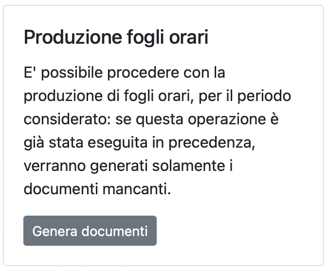

# Introduzione a RECCO

Il sistema nasce con lo scopo di ottimizzare la gestione degli aspetti di rendicontazione delle ore lavorate dal personale in progetti di ricerca.
Obiettivo del sistema è quello di fornire uno strumento intuitivo volto a minimizzare i tempi necessari per la produzione della documentazione necessaria in fase di rendiconto.

### Caratteristiche del sistema ###

Sistemi di integrazione:
* Integrazione con il sistema [ePAS](https://epas.amministrazione.cnr.it) per il recupero delle ore lavorate dal personale, di permessi, ferie o altre informazioni utili
* Accesso al sistema con credenziali [Microsoft Office](https://www.office.com) fornite dall'Ente
* Supporto a comunicazioni e sistemi di notifica via email
* Generazione automatica di fogli da compilare, con successiva importazione, in formato Microsoft Excel
* Generazione automatica di fogli riassuntivi specifici per progetto, in formato Microsoft Excel e PDF
* Memorizzazione dei dati su database, con possibilità di accesso semplificata
* Possibilità di fare backup dei dati memorizzati, esportandoli sotto forma di file ZIP
* Possibilità di assegnare ruoli diversi per diversi account del sistema
* Supporto a log volti a memorizzare le operazioni svolte all'interno della piattaforma
* Supporto ad istituti distributi su più sedi
* Supporto a template di esportazione differenti
* Supporto a personale di diverso profilo e con caratteristiche differenti (es. part-time)
* Possibilità di fornire alle singole unità di personale coinvolte informazioni dettagliate di rendiconto e sulle attività progettuali in corso
* Invio automatizzato di fogli orari specifici alle singole unità di personale coinvolte in attività di ricerca (e solo a loro)
* Possibilità di definire una finestra temporale per il caricamento di dati da parte delle unità di personale coinvolte in attività di ricerca
* Possibilità di chiedere nuovamente la compilazione alle sole unità di personale che non hanno ancora inviato i dati richiesti
* Possibilità di correggere i fogli orari compilati ricevuti dalle unità di personale coinvolte in attività di ricerca
* Supporto a progetti di ricerca di diverso tipo (es. Europei, PNRR, ecc.)
* Supporto a progetti di ricerca dotati di più di un main contact/principal investigator
* Supporto ad attività di rendicontazione a livello di WP/OR di progetto
* Supporto a template riassuntivi specifici in formato Microsoft Excel, con allocazione degli stessi su diversi progetti
* Supporto al blocco di attività di rendicontazione in giornate o periodi di missione
* Supporto all'estrazione dei soli fogli orari contenenti missioni, per una successiva analisi puntuale
* Supporto alla sostituzione di timesheet
* Supporto alla produzione di timesheet specifici per persone specifiche

### Limiti del sistema ###

Allo stato attuale, il sistema:
* Permette la gestione di dati esclusivamente per il singolo mese passato, rispetto a quello corrente
* Non supporta personale non strutturato

### Utenti e ruoli ###

Il sistema supporta i seguenti tipi di utenti, dove ogni utente può essere associato ad un solo ruolo:
* `amministratore`: ruolo solitamente assegnato a personale tecnico, è in grado di eseguire qualunque operazione
* `amministratore-readonly`: ruolo solitamente assegnato al direttore dell'istituto, è in grado di visualizzare tutte le informazioni disponibili, senza poter operare su di esse
* `gestione-completa`: ruolo in grado di eseguire qualunque operazione sulla piattaforma, ad esclusione delle attività di configurazione della stessa
* `gestione-personale`: ruolo in grado di gestire le unità di personale registrate all'interno della piattaforma
* `gestione-personale`: ruolo in grado di gestire i progetti registrati all'interno della piattaforma
* `gestione-rendicontazione`: ruolo in grado di seguire e gestire le attività di rendicontazione gestite dalla piattaforma
* `personale`: ruolo assegnato a tutte le unità di personale coinvolte in attività di ricerca

### Il processo implementato ###

Per quanto riguarda le attività di preparazione alla messa in piedi del sistema, sono necessarie le seguenti attività.
* Il sistema è configurato correttamente (da utenti con il ruolo di `amministratore`)
* Tutte le unità di personale coinvolte nel progetto sono inserite all'interno della piattaforma (da utenti con il ruolo di `gestione-personale`)
* Tutti i progetti sono inseriti all'interno della piattaforma, eventualmente suddivisi per WP/OR (da utenti con il ruolo di `gestione-progetti`)
* Tutte le unità di personale coinvolte per ogni singolo progetto sono state associate ad esso, in qualità di partecipanti (da utenti con il ruolo di `gestione-progetti`)

Il processo implementato vede lo svolgimento delle seguenti attività:
1. All'inizio di un nuovo mese, uno degli utenti con il ruolo di `gestione-personale` avvia l'operazione di generazione e condivisione dei fogli orari da compilare con il personale coinvolto in attività di ricerca, tramite l'opzione "Produzione fogli orari" disponibile all'interno della piattaforma

2. La singola unità di personale si vedrà recapitare via email il foglio orario (in formato Microsoft Excel) con le ore lavorate per il mese passato; la email conterrà informazioni per poter caricare il documento compilato
3. La singola unità di personale, dopo aver debitamente compilato il documento ricevuto, caricherà lo stesso al link riportato nella email
4. Il sistema importerà il documento e lo processerà di conseguenza, inviando via email un messaggio (di successo o di errore) all'utente che ha caricato il file
5. Alla corretta importazione del documento, il sistema genererà in automatico i documenti riassuntivi, specifici per ogni progetto, per l'unità di personale che ha caricato il documento; questi documenti verranno prodotti sia in formato Microsoft Excel che (opzionamente) in formato PDF
6. Nel caso in cui i documenti in formato PDF siano stati prodotti, questi verranno inviati via email all'unità di personale, chiedendo di firmarli e caricarli ad un link fornito nell'email
7. Una volta firmati i documenti, la singola unità di personale caricherà gli stessi al link indicato
