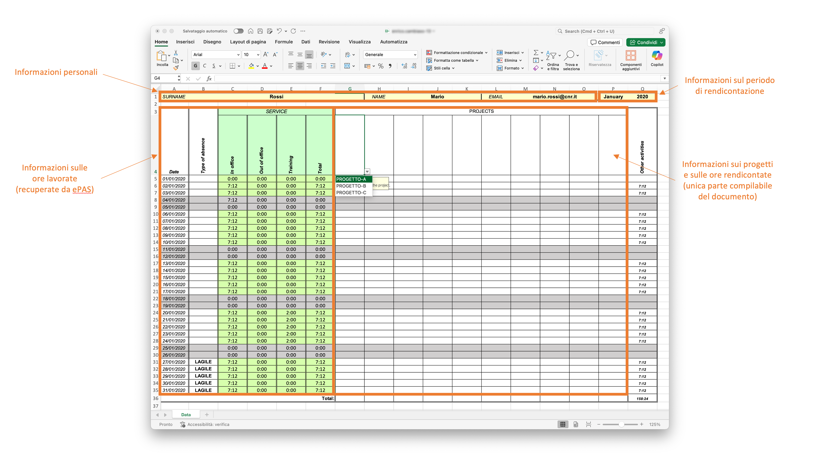

# Comunicazione delle ore rendicontate

Per poter comprendere al meglio il funzionamento del sistema, è necessario descrivere il processo di comunicazione delle ore rendicontate sui propri progetti.

### Processo di comunicazione delle ore rendicontate ###

Il processo prevede, ogni mese, una volta al mese, il caricamento all'interno della piattaforma delle informazioni sulle ore rendicontate sui propri progetti per il mese precedente a quello corrente.
E' importante considerare che al momento la piattaforma non permette di rendicontare ore per periodi diversi dal mese precedente a quello corrente.

In particolare, dal punto di vista dell'unità di personale coinvolta in attività di ricerca, il processo è idealmente il seguente:
1. A inizio mese (tipicamente), arriverà una email sulla propria casella di posta elettronica, notificando la disponibilità del proprio foglio orario all'interno della piattaforma RECCO
2. Accedendo alla piattaforma RECCO con le proprie credenziali Microsoft fornite dall'Ente, sarà possibile [scaricare il relativo documento]()
3. L'unità di personale compilerà il documento di conseguenza, utilizzando l'applicativo Microsoft Excel (è importante considerare che altri applicativi non sono al momento supportati)
4. Accedendo alla piattaforma RECCO con le proprie credenziali Microsoft fornite dall'Ente, sarà possibile [caricare il documento compilato]()
5. La piattaforma RECCO genererà i timesheet mensili per ogni progetto per il quale si è lavorato durante il periodo di riferimento
6. Arriverà una email per ogni progetto specificato all'interno del foglio orario compilato (raggruppando i progetti, ad esempio, in caso di suddivisione degli stessi in Work Package/Obiettivi Realizzativi/Spoke), indicando l'avvenuta generazione del relativo timesheet in formato PDF
7. Accedendo alla piattaforma RECCO con le proprie credenziali Microsoft fornite dall'Ente, sarà possibile scaricare i documenti prodotti
8. L'unità di personale firmerà i documenti di conseguenza
9. Accedendo alla piattaforma RECCO con le proprie credenziali Microsoft fornite dall'Ente, sarà possibile caricare il documenti firmati

### Fogli orari da compilare ###

Al fine di uniformare il formato dei dati raccolti, è richiesta la compilazione di un documento Microsoft Excel prodotto ad-hoc, ogni mese.
Tale documento verrà prodotto da utenti specifici all'interno della piattaforma, tipicamente ogni mese, ad inizio mese, e condiviso con l'unità di personale coinvolta in attività di ricerca, attraverso la piattaforma RECCO.

Il documento assume la forma mostrata in figura seguente.

Come è possibile notare, una prima parte in alto mostra le informazioni personali dell'unità di personale e il periodo di rendicontazione considerato.
Dunque, sulla parte a sinistra del documento vengono mostrate informazioni sulle ore lavorate, compilate a partire dai dati presenti sulla piattaforma [ePAS](https://epas.amministrazione.cnr.it).
Dunque, la parte al centro del documento, l'unica parte compilabile dall'utente, è demandata alla segnalazione delle ore lavorate per ogni singolo progetto.
In particolare, per ogni colonna, è necessario specificare, compilando da sinistra a destra (celle `F4:O4`), il singolo progetto per il quale si intende rendicontare ore, tra quelli disponibili da menu a tendina.
I progetti mostrati in tale menu a tendina sono tutti i progetti in corso per almeno un giorno del periodo di riferimento corrente che vedono la partecipazione della specifica unità di personale.

### Operazioni utili ai fini della comunicazione delle ore rendicontate sui progetti ###

Vengono di seguito descritte le operazioni utili ai fini della comunicazione delle ore rendicontate sui progetti.

#### Download dei fogli mensili da compilare ####

Nel caso in cui la piattaforma sia configurata per inviare il documento dei fogli orari da compilare via email, sarà possibile scaricare il documento ricevuto via email od, in alternativa, seguire il processo descritto di seguito.

In alternativa, sulla base di quanto descritto relativamente ai [fogli orari mensili](utilizzo_my.md#fogli-orari-mensili), per poter scaricare il proprio foglio mensile da compilare per il periodo corrente, occorre procedere come segue:
1. Accedere alla piattaforma RECCO
2. Aprire il menu `I miei dati`
3. Se disponibile, cliccare il bottone `Mostra dettagli` per consultare eventuali informazioni in merito alla stima delle ore previste per i vari progetti
4. Cliccare il bottone `Download` all'interno della scheda `Foglio mensile da compilare` (se non disponibile, occorre attendere la generazione del documento, si veda la [descrizione di dettaglio](utilizzo_my.md#fogli-orari-mensili))
5. Verrà scaricato il documento con il foglio mensile da compilare

#### Consultazione delle stime di rendicontazione per il periodo di riferimento corrente ####

Se tale funzione è abilitata all'interno della piattaforma, è possibile mostrare, per ogni progetto al quale l'unità di personale partecipa durante il periodo di riferimento corrente, informazioni sulla previsione dell'effort atteso da proposta, secondo quanto stimato ed indicato dal Principal Investigator (per maggiori informazioni, si veda la [descrizione di dettaglio](utilizzo_my.md#fogli-orari-mensili)).

In particolare, per consultare le stime di rendicontazione per il periodo di riferimento corrente, se tale opzione è abilitata, procedere come segue:
1. Accedere alla piattaforma RECCO
2. Aprire il menu `I miei dati`
3. Se disponibile, cliccare il bottone `Mostra dettagli` per consultare eventuali informazioni in merito alla stima delle ore previste per i vari progetti
4. Verrà aperta una schermata di dettaglio

#### Comunicazione delle ore rendicontate per il periodo di riferimento corrente ####

Nel caso in cui l'email ricevuta con il foglio orario contenga un link di upload diretto del documento, è possibile caricare il documento accedendo direttamente al link e seguendo le indicazioni fornite.
In alternativa, la comunicazione delle ore rendicontate per il periodo di riferimento corrente avviene tramite caricamento del proprio foglio mensile, debitamente compilato.
Tale comunicazione deve avvenire entro le scadenze previste, che dipendono dall'installazione specifica della piattaforma.
Occorre inoltre considerare che nel caso in cui non vi siano ore da rendicontare in alcun progetto, non è necessario eseguire alcuna comunicazione.

In particolare, per comunicare le ore rendicontate per il periodo di riferimento corrente, occorre procedere come segue:
1. Accedere alla piattaforma RECCO
2. Aprire il menu `I miei dati`
3. Se tale opzione è disponibile (in caso alternativo, si veda la [descrizione di dettaglio](utilizzo_my.md#fogli-orari-mensili)), cliccare il bottone `Carica` all'interno della scheda `Caricamento foglio mensile`
4. Verrà aperta una dinestra di caricamento del documento
5. Compilare le informazioni come da richiesta
6. Cliccare il bottone `Invia` per inviare il documento compilato
7. Consultare eventuali messaggi di successo (o di errore) mostrati a video e (se previste da configurazione della piattaforma) eventuali email ricevute

#### Consultazione dell'archivio dei fogli orari compilati inviati ####

E' disponibile una scheda di dettaglio relativa all'archivio di tutti i fogli orari mensili compilati inviati.

In particolare, per poter visualizzare tutti i fogli orari compilati compilati memorizzati all'interno della piattaforma, procedere come segue:
1. Accedere alla piattaforma RECCO
2. Aprire il menu `I miei dati`
3. Cliccare il bottone `Visualizza documenti` all'interno della scheda `Archivio dei fogli mensili inviati`
4. Si aprirà una pagina contenente tutti i documenti di riferimento, ordinati per anno e mese
5. Cliccare il tasto `Download` adiacente al periodo di interesse
6. Verrà avviato il download del documento relativo
