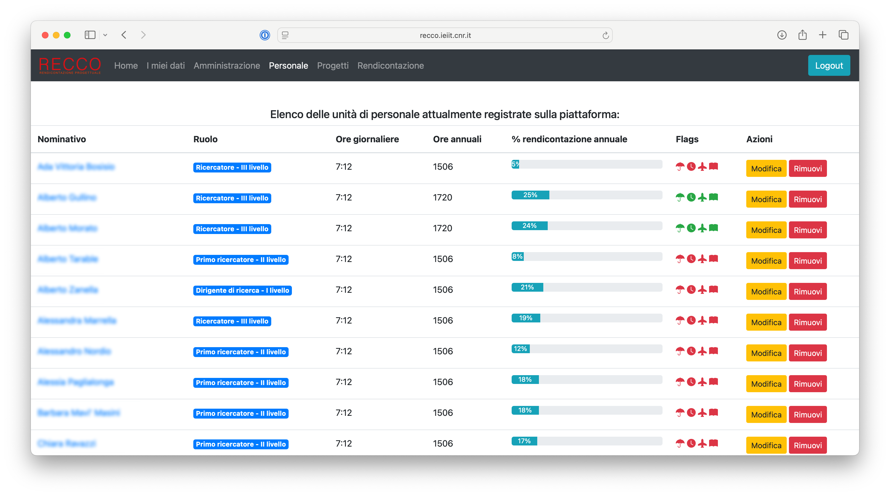
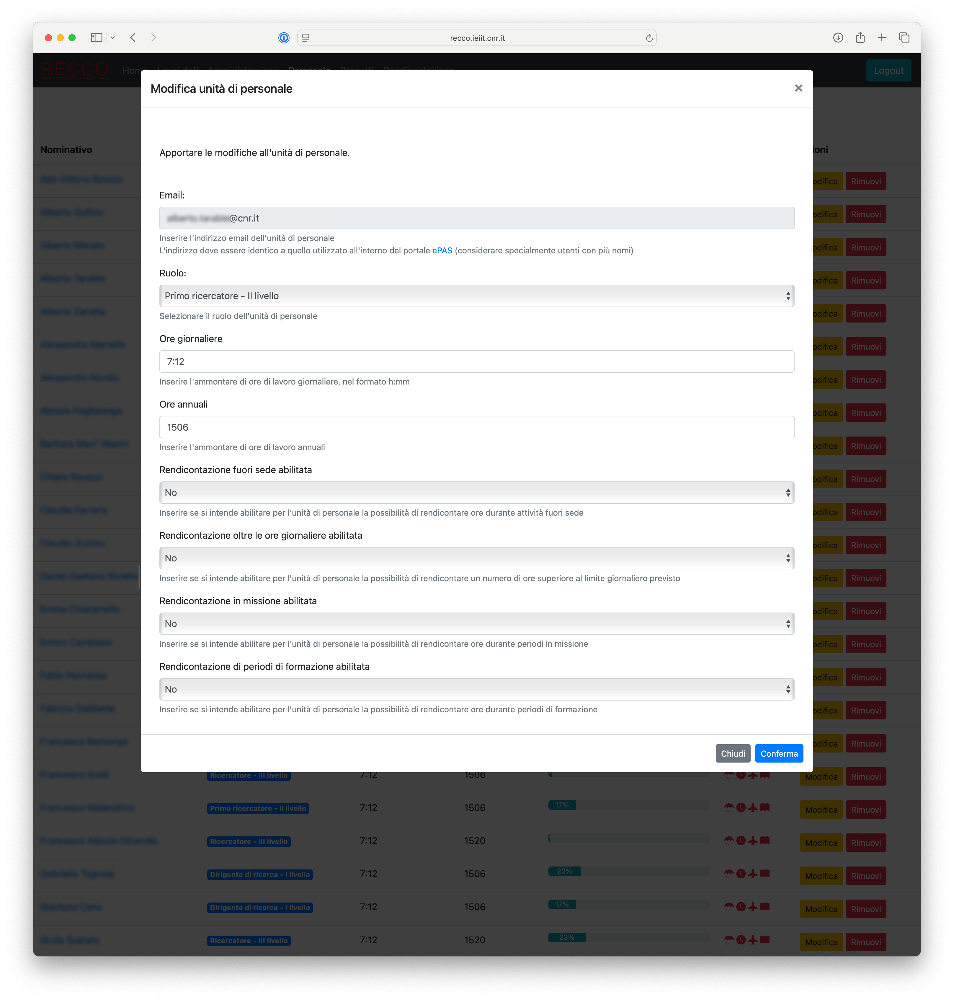

# Gestione del personale

La schermata di gestione del personale è riportata a seguire.

### Personale ###

Questa sezione permette la gestione delle unità di personale.
E' possibile vedere quante unità di personale sono registrate all'interno della piattaforma, considerando che non tutte le unità di personale strutturato che afferisce all'istituto potrebbero essere incluse (ad esempio, è possibile includere solo le unità coinvolte in attività di ricerca finanziata).

Cliccando sul bottone `Gestisci personale` viene aperta una nuova finestra dedicata.

#### Consultazione delle unità di personale registrate all'interno della piattaforma ####

Tale finestra mostra una lista di unità di personale registrate all'interno del sistema, con le seguenti informazioni:
* nominativo completo (al click verrà creata una nuova email verso il nominativo selezionato)
* ruolo e livello
* ore giornaliere da svolgere
* ore annuali da svolgere
* percentuale di ore rendicontate nell'anno corrente, rispetto al totale delle ore annuali

#### Modifica di una unità di personale ####

Per ogni unità di personale è possibile modificare le informazioni associate (bottone `Modifica`).

*Finestra di modifica di una unità di personale*

#### Rimozione di una unità di personale ####

E' inoltre possibile rimuovere (previa conferma) una unità di personale specifica dal sistema (bottone `Rimuovi`); in questo caso, l'unità di personale verrà rimossa solamente se questa non è coinvolta in alcun progetto di ricerca.

*Finestra di conferma di rimozione di una unità di personale*

#### Aggiunta di una unità di personale ####

E' inoltre possibile registrare una nuova unità di personale all'interno del sistema, tramite il bottone `Aggiungi unità di personale`.

*Finestra di aggiunta di una nuova unità di personale*

### Fogli orari ###

Questa sezione riporta i dettagli sui fogli orari prodotti.

#### Consultazione dei fogli orari prodotti ####

E' disponibile una scheda di dettaglio relativa ai fogli orari prodotti per il periodo di riferimento corrente, come mostrato nella figura seguente.

*Scheda di dettaglio dei fogli orari prodotti per il mese di riferimento corrente*

In particolare, la scheda mostra informazioni quali il numero di fogli orari prodotti e la percentuale di questi rispetto al numero di unità di personale registrate all'interno della piattaforma.
Occorre considerare che una percentuale inferiore al 100% può indicare uno dei seguenti scenari:
* Si è verificato un errore in fase di generazione di uno o più documenti (es. l'unità di personale non è più associata ad un account ePAS, la piattaforma ePAS non è temporaneamente raggiungibile, le informazioni disponibili non sono complete, ecc.)
* Una o più unità di personale non sono coinvolte in alcun progetto, per il periodo di rifererimento considerato

In caso la percentuale fornita sia inferiore al 100%, si invita a verificare, con il supporto del referente tecnico, la causa di tale anomalia, considerati i due possibili scenari menzionati.

Cliccando il bottone `Visualizza documenti` è possibile consultare tutti i documenti generati: per ogni documento è possibile scaricare lo stesso o eliminarlo.

#### Consultazione dell'archivio dei fogli orari prodotti ####

Analogamente alla consultazione dei fogli orari per il periodo di riferimento corrente, è disponibile una scheda di dettaglio relativa all'archivio di tutti i fogli orari prodotti, come mostrato nella figura seguente.

*Scheda di dettaglio dell'archivio dei fogli orari prodotti*

Cliccando il bottone `Visualizza documenti` è possibile selezionare il periodo di riferimento di interesse (espresso nel formato `YYYYMM`), dunque accedere ai documenti di interesse, con possibilità di scaricarli o eliminarli.

#### Produzione di fogli orari ####

TODO
