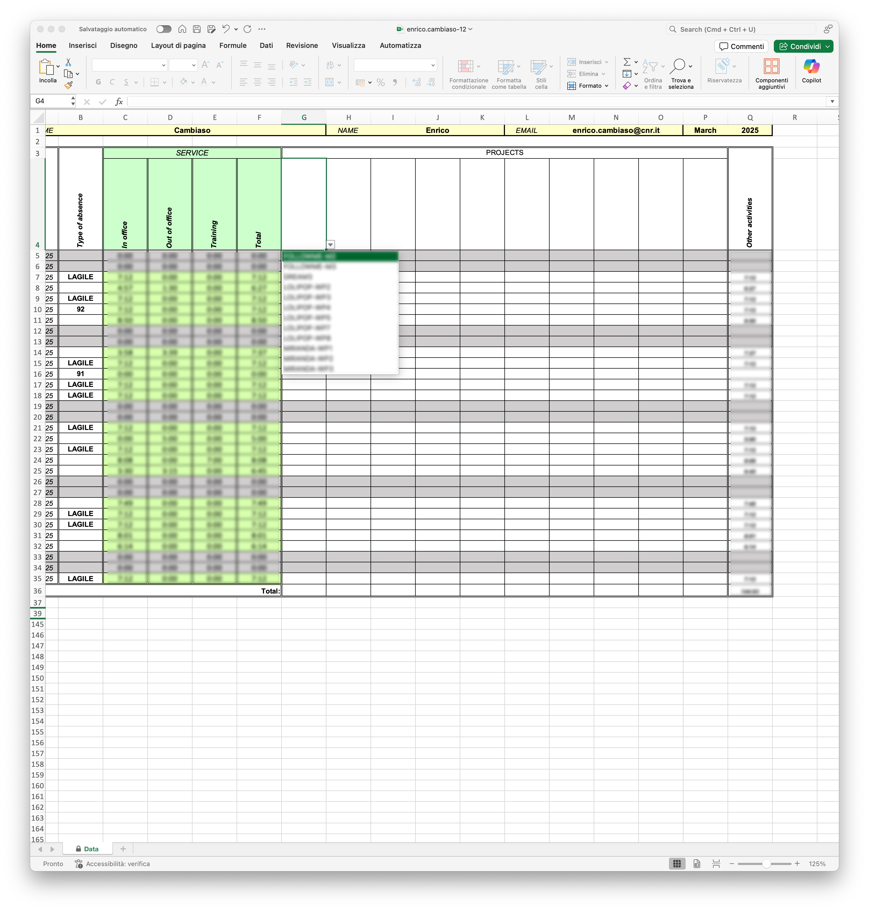

# Gestione del personale

La schermata di gestione del personale è riportata a seguire.

### Personale ###

Questa sezione permette la gestione delle unità di personale.
E' possibile vedere quante unità di personale sono registrate all'interno della piattaforma, considerando che non tutte le unità di personale strutturato che afferisce all'istituto potrebbero essere incluse (ad esempio, è possibile includere solo le unità coinvolte in attività di ricerca finanziata).

Cliccando sul bottone `Gestisci personale` viene aperta una nuova finestra dedicata.

#### Consultazione delle unità di personale registrate all'interno della piattaforma ####

Tale finestra mostra una lista di unità di personale registrate all'interno del sistema, con le seguenti informazioni:
* nominativo completo (al click verrà creata una nuova email verso il nominativo selezionato)
* ruolo e livello
* ore giornaliere da svolgere
* ore annuali da svolgere
* percentuale di ore rendicontate nell'anno corrente, rispetto al totale delle ore annuali

#### Modifica di una unità di personale ####

Per ogni unità di personale è possibile modificare le informazioni associate (bottone `Modifica`).

*Finestra di modifica di una unità di personale*

Per modificare una unità di personale, procedere come segue:
1. Accedere alla piattaforma RECCO
2. Aprire il menu `Personale`
3. Cliccare il bottone `Modifica` adiacente all'unità di personale da modificare
4. Si aprirà una finestra di modifica: aggiornare i dati secondo le necessità
5. Cliccare il bottone `Conferma` per confermare l'operazione

#### Rimozione di una unità di personale ####

E' inoltre possibile rimuovere (previa conferma) una unità di personale specifica dal sistema (bottone `Rimuovi`).
In questo caso, l'unità di personale verrà rimossa anche se questa è coinvolta in progetti di ricerca, benché sia preferibile rimuoverla dai progetti di ricerca in corso prima di procedere con la rimozione dell'unità di personale.

Al fine di evitare eventuali problematiche, è fondamentale rimuovere unità di personale non più in rapporti con l'Ente prima della generazione dei fogli orari mensili.

Occorre inoltre notare che la rimozione di una unità di personale non comporta l'effettiva eliminazione dei dati ad essa associati, né della stessa unità di personale, in quanto potrebbero essere presenti informazioni utili relative a progetti terminati.
Per questo motivo, con l'operazione di rimozione, l'unità di personale viene di fatto disabilitata (per riabilitarla è necessario il supporto di un utente con il ruolo di `amministratore`).
In particolare, l'eliminazione rende di fatto non più operativa l'unità di personale relativa e, pertanto, non sarà più visibile nell'elenco delle unità di personale, né sarà associabile a progetti.

*Finestra di conferma di rimozione di una unità di personale*

Per rimuovere una unità di personale, procedere come segue:
1. Accedere alla piattaforma RECCO
2. Aprire il menu `Personale`
3. Cliccare il bottone `Rimuovi` adiacente all'unità di personale da rimuovere
4. Si aprirà una finestra di conferma: cliccare il bottone `Conferma` per confermare l'operazione

#### Aggiunta di una unità di personale ####

E' inoltre possibile registrare una nuova unità di personale all'interno del sistema, tramite il bottone `Aggiungi unità di personale`.

*Finestra di aggiunta di una nuova unità di personale*

Per aggiungere una unità di personale, procedere come segue:
1. Accedere alla piattaforma RECCO
2. Aprire il menu `Personale`
3. Cliccare il bottone `Aggiungi unità di personale` in fondo alla pagina
4. Si aprirà una finestra di aggiunta: inserire i dati secondo le necessità
5. Cliccare il bottone `Conferma` per confermare l'operazione

Occorre in particolare considerare che l'indirizzo email da specificare deve coincidere con quello utilizzato dalla piattaforma [ePAS](https://epas.amministrazione.cnr.it); solitamente il formato segue la regola `PrimoNomeSecondoNome.Cognome@cnr.it` (ad esempio, per l'unità di personale fittizia Mario Stefano Rossi, la email associata sarebbe mariostefano.rossi@cnr.it).

### Fogli orari ###

Questa sezione riporta i dettagli sui fogli orari prodotti.

#### Consultazione dei fogli orari prodotti ####

E' disponibile una scheda di dettaglio relativa ai fogli orari prodotti per il periodo di riferimento corrente, come mostrato nella figura seguente.

*Scheda di dettaglio dei fogli orari prodotti per il mese di riferimento corrente*

In particolare, la scheda mostra informazioni quali il numero di fogli orari prodotti e la percentuale di questi rispetto al numero di unità di personale registrate all'interno della piattaforma.
Occorre considerare che una percentuale inferiore al 100% può indicare uno dei seguenti scenari:
* Si è verificato un errore in fase di generazione di uno o più documenti (es. l'unità di personale non è più associata ad un account [ePAS](https://epas.amministrazione.cnr.it), la piattaforma [ePAS](https://epas.amministrazione.cnr.it) non è temporaneamente raggiungibile, le informazioni disponibili non sono complete, ecc.)
* Una o più unità di personale non sono coinvolte in alcun progetto, per il periodo di rifererimento considerato

In caso la percentuale fornita sia inferiore al 100%, si invita a verificare, con il supporto del referente tecnico, la causa di tale anomalia, considerati i due possibili scenari menzionati.

Cliccando il bottone `Visualizza documenti` è possibile consultare tutti i documenti generati: per ogni documento è possibile scaricare lo stesso o eliminarlo.

Pertanto, per poter visualizzare i fogli orari prodotti per il periodo di riferimento corrente, procedere come segue:
1. Accedere alla piattaforma RECCO
2. Aprire il menu `Personale`
3. Cliccare il bottone `Visualizza documenti` all'interno della scheda `Fogli orari prodotti`
4. Si aprirà una pagina contenente tutti i documenti, con la possibilità di scaricarli o rimuoverli

#### Consultazione dell'archivio dei fogli orari prodotti ####

Analogamente alla consultazione dei fogli orari per il periodo di riferimento corrente, è disponibile una scheda di dettaglio relativa all'archivio di tutti i fogli orari prodotti, come mostrato nella figura seguente.

*Scheda di dettaglio dell'archivio dei fogli orari prodotti*

Cliccando il bottone `Visualizza documenti` è possibile selezionare il periodo di riferimento di interesse (espresso nel formato `YYYYMM`), dunque accedere ai documenti di interesse, con possibilità di scaricarli o eliminarli.

Pertanto, per poter visualizzare tutti i fogli orari presenti all'interno della piattaforma, procedere come segue:
1. Accedere alla piattaforma RECCO
2. Aprire il menu `Personale`
3. Cliccare il bottone `Visualizza documenti` all'interno della scheda `Archivio fogli orari`
4. Si aprirà una pagina contenente tutti i periodi di riferimento, espressi nel formato `YYYYMM`
5. Selezionare il periodo di riferimento di interesse cliccando sul bottone `Visualizza`
6. Si aprirà una nuova pagina contenente tutti i documenti, con la possibilità di scaricarli o rimuoverli

#### Produzione di fogli orari ####

E' disponibile una scheda di dettaglio relativa alla produzione di fogli orari per il periodo di riferimento corrente, come mostrato nella figura seguente.

*Scheda di dettaglio per la produzione di fogli orari per il periodo di riferimento corrente*

Una volta confermata l'operazione, interfacciandosi con la piattaforma [ePAS](https://epas.amministrazione.cnr.it), verranno scaricati i dati sulle ore lavorate nel periodo di riferimento corrente, per ogni unità di personale coinvolta in attività di ricerca (da notare che eventuali unità di personale non associate a progetti in corso vengono in questa fase ignorate). Infine, verrà prodotto un foglio Microsoft Excel ad-hoc, contenente anche le informazioni sui progetti in corso per l'unità di personale di riferimento, e spazi appositi per la compilazione.

La schermata di conferma dell'operazione, con ulteriori dettagli, descritti in modo approfondito in seguito, è mostrata in figura seguente.

*Schermata di conferma di produzione di fogli orari*

Un esempio di foglio orario generato è disponibile nella figura seguente.

*Esempio di foglio orario da compilare*

In particolare, per ogni giorno del mese (colonna `A`), il foglio include informazioni sul tipo di assenza (colonna `B`), le ore lavorate in ufficio (colonna `C`), fuori ufficio (colonna `D`), il totale delle ore lavorate (colonna `E`), il totale delle altre attività (colonna `P`).

Da notare che i codici di assenza di riferimento sono gli stessi utilizzati dalla piattaforma [ePAS](https://epas.amministrazione.cnr.it). Maggiori informazioni sono disponibili sulla [sulla pagina dedicata su GitHub](https://github.com/consiglionazionaledellericerche/epas/blob/b9155fc0127fab96b3121236a5d07e7b83ee8852/app/models/absences/definitions/DefaultAbsenceType.java).

Per ogni giorno è inoltre possibile specificare quante ore sono state lavorate per ogni progetto che vede coinvolta l'unità di personale: per far ciò, occorre selezionare (in riga `4`, colonne da `F` a `O`, a partire dalla prima colonna libera sulla sinistra) l'acronimo del progetto, tramite un menu a tendina che mostrerà solamente i progetti di interesse.
Dunque, per ogni giorno, sarà possibile indicare quante ore sono state lavorate sul progetto.

Occorre notare che le celle di selezione progetto e di indicazione delle ore lavorate sono le uniche celle modificabili del documento. Inoltre, le righe relative a giorni in cui le ore lavorate sono pari a `0:00` (es. giorni di weekend o di ferie) non sono modificabili.
Analogamente, in base alle impostazioni di configurazione della piattaforma, le righe relative a giornate con periodi in missione potrebbero non essere modificabili.

Da notare inoltre che il foglio colorerà di rosso le celle relative ad una errata compilazione, dovuta ad uno dei seguenti scenari:
* le ore allocate nella giornata sono superiori alle ore lavorate in sede
* le ore allocate nella gioranta sono superiori alle ore di lavoro giornaliere per l'unità di personale di riferimento (es. `7:12` ore)

Una volta generato il foglio orario da compilare per ogni singola unità di personale, quest'ultima riceverà un messaggio email di notifica.
Infine, una volta completata l'attività, verrà inviata una email di conferma all'utente della piattaforma che ha avviato la generazione dei documenti.

Per procedere con la generazione di fogli orari per il periodo di riferimento corrente, eseguire le seguenti operazioni:
1. Accedere alla piattaforma RECCO
2. Aprire il menu `Personale`
3. Cliccare il bottone `Genera documenti` all'interno della scheda `Produzione fogli orari`
4. Si aprirà una finestra di conferma: cliccare il bottone `Conferma` per confermare l'operazione

#### Produzione di fogli orari per utenti specifici ####

Nel caso in cui siano già stati prodotti documenti in precedenza per il periodo di riferimento corrente, verranno prodotti solamente i documenti mancanti.
Questa operazione è possibile solo nel caso in cui siano già stati prodotti fogli orari per tutti gli utenti del sistema.
Se così non fosse, l'esecuzione delle operazioni riportate in seguito porterebbe ad una generazione di tutti i documenti, con eventuale notifica via email di avvenuta generazione a tutte le unità di personale registrate nel sistema.
Questa funzionalità è utile per poter generare documenti specifici, come dettagliato di seguito.

Per procedere con la produzione di fogli orari per utenti specifici, procedere come segue:
1. Accedere alla piattaforma RECCO
2. Aprire il menu `Personale`
3. Cliccare il bottone `Genera documenti` all'interno della scheda `Produzione fogli orari`
4. Si aprirà una finestra di conferma: cliccare il bottone `Visualizza documenti` per visualizzare i documenti prodotti in precedenza (in alternativa, è possibile cliccare il bottone `Visualizza documenti` all'interno della scheda `Fogli orari prodotti`)
5. Rimuovere il documento da produrre nuovamente, cliccando il relativo bottone `Elimina`
6. Aprire nuovamente il menu `Personale` per tornare alla schermata principale di gestione
7. Cliccare il bottone `Genera documenti` all'interno della scheda `Produzione fogli orari`
8. Si aprirà una finestra di conferma: cliccare il bottone `Conferma` per confermare l'operazione
