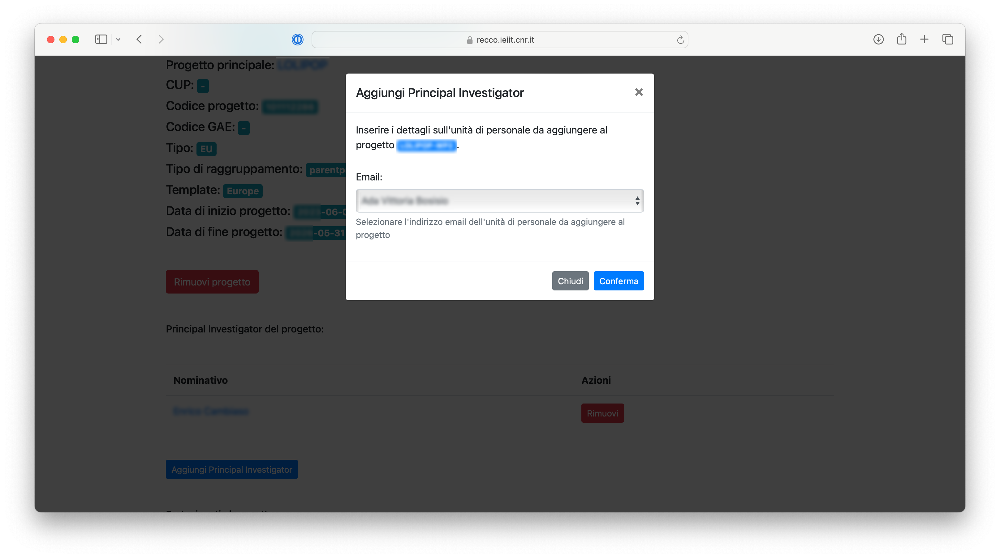
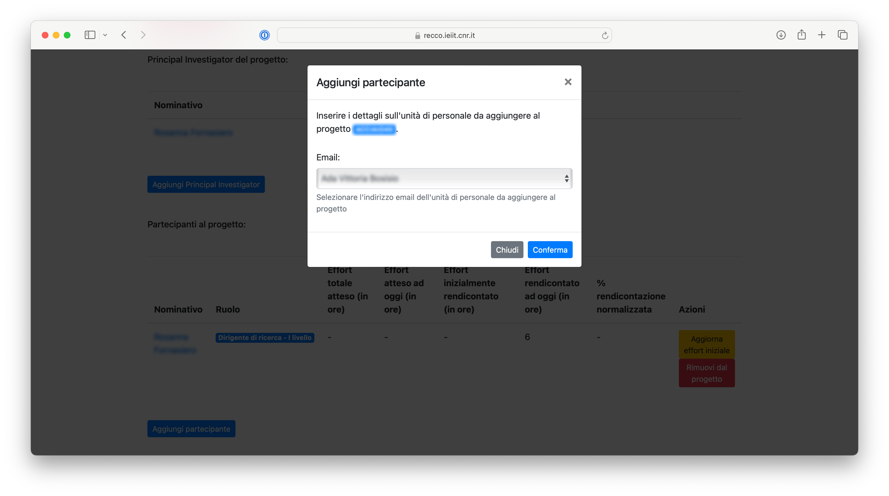

# Gestione dei progetti

La schermata di gestione dei progetti è riportata a seguire.


### Progetti ###

Questa sezione permette la gestione dei progetti registrati all'interno della piattaforma.
E' possibile vedere quanti progetti sono registrati all'interno della piattaforma.

Cliccando sul bottone `Gestisci progetti` viene aperta una nuova finestra dedicata.

#### Consultazione dei progetti registrati all'interno della piattaforma ####


Tale finestra mostra una lista di progetti registrati all'interno del sistema, con le seguenti informazioni:
* codice progetto
* acronimo univoco del progetto
* titolo esteso del progetto
* tipologia di progetto
* percentuale di avanzamento del progetto nel tempo
* percentuale di rendicontazione sul progetto, normalizzata rispetto all'istante corrente

In particolare, la percentuale di rendicontazione normalizzata viene calcolata andando a sommare le ore di rendicontazione totali previste per l'intero progetto per tutte le unità di personale, dunque rapportandole all'attuale stato di avanzamento del progetto; infine, confrontando le ore effettivamente rendicontate ad oggi da tutti i partecipanti al progetto con tale valore.

#### Informazioni sul progetto principale ####

Occorre considerare che ogni progetto inserito nella piattaforma può essere associato ad un "progetto principale", una stringa testuale (senza spazi o caratteri speciali) che viene utilizzata per raggruppare più progetti.
Ad esempio, l'utilizzo di tale parametro può tornare utile per poter raggruppare più progetti in uno solo, in fase di esportazione o visualizzazione; si pensi ad esempio ad una suddivisione di un progetto in più Work Packages/Obiettivi Realizzativi/Spoke.

In fase di visualizzazione, un "progetto principale" erediterà i valori di campi quale il titolo dal primo "sotto-progetto" (il primo progetto, in ordine alfabetico, che fa uso dell'acronimo del "progetto principale").
Inoltre, non sarà possibile modificare un "progetto principale", ma soltanto i singoli "sotto-progetti" ad esso associati.

**Download dei dati relativi alla rendicontazione di un progetto principale**

In aggiunta all'elenco dei "sotto-progetti", alla visualizzazione di un "progetto principale", per gli amministratori di sistema e per i Principal Investigator di tutti i sotto-progetti è possibile visualizzare una scheda che permette di scaricare dati riassuntivi di rendiconto sull'intero progetto.

In particolare, è possibile scaricare un documento in [formato CSV](https://it.wikipedia.org/wiki/Comma-separated_values) (dunque, importabile in modo molto semplice su Microsoft Excel, o facilmente interpretabile da un software) contenente i dettagli delle ore rendicontate sul progetto.
Occorre tuttavia notare che tale documento includerà solamente le informazioni sulle ore rendicontate tramite la piattaforma RECCO: dunque, eventuali ore rendicontate antecedentemente all'utilizzo della piattaforma non verranno esportate.

L'output fornito avrà un contenuto analogo al seguente.

```
Acronym,Year,Month,mario.rossi@cnr.it,stefano.bianchi@cnr.it
Project1-WP1,2025,01,10,20
Project1-WP1,2025,02,11,21
Project1-WP2,2025,03,12,22
```

A tal proposito, al fine di esportare i dettagli sulle ore rendicontate dai partecipanti per un progetto specifico, procedere come segue:
Per rimuovere un progetto, procedere come segue:
1. Accedere alla piattaforma RECCO
2. Aprire il menu `Progetti`
3. Cliccare il bottone `Visualizza` per aprire il progetto da rimuovere
4. Cliccare il bottone `Scarica` all'interno della scheda `Download dei dati di rendiconto di progetto` per procedere con l'esportazione
5. Verrà scaricato il [file CSV](https://it.wikipedia.org/wiki/Comma-separated_values) contenente le informazioni richieste

#### Modifica di un progetto ####

E' possibile modificare le informazioni associate ad un progetto (bottone `Modifica`).
Tale funzionalità non è disponibile per i progetti terminati.
Inoltre, nella schermata principale, non è disponibile un bottone di modifica nel caso in cui il progetto sia considerato "progetto principale", in quanto tale bottone sarà disponibile per i singoli "sotto-progetti" dello stesso.


*Finestra di modifica di un progetto*

In particolare, in fase di modifica, occorre considerare i seguenti aspetti:
* il valore del campo `Raggruppamento` indica come si intende raggruppare più progetti simili in fase di esportazione dei dati/generazione dei timesheet: sono disponibili i valori `Acronimo` (le informazioni esportate riguardano solamente il progetto corrente; scelta preferibile per tutti i progetti non legati ad altri e non suddivisi in Work Packages/Obiettivi Realizzativi/Spoke) oppure `Progetto principale` (le informazioni esportate vengono raggruppate insieme ad altri progetti con il medesimo "progetto principale"; scelta preferibile per progetti suddivisi in Work Packages/Obiettivi Realizzativi/Spoke)
* il template di esportazione identifica il template da utilizzare per la generazione dei timesheet, tra quelli disponibili

Per modificare un progetto, procedere come segue:
1. Accedere alla piattaforma RECCO
2. Aprire il menu `Progetti`
3. Cliccare il bottone `Modifica` adiacente al progetto da modificare
4. Si aprirà una finestra di modifica: aggiornare i dati secondo le necessità
5. Cliccare il bottone `Conferma` per confermare l'operazione

#### Aggiunta di un progetto ####

E' inoltre possibile registrare un nuovo progetto all'interno del sistema, tramite il bottone `Aggiungi progetto`.


*Finestra di aggiunta di un nuovo progetto*

Per aggiungere un nuovo progetto, procedere come segue:
1. Accedere alla piattaforma RECCO
2. Aprire il menu `Progetti`
3. Cliccare il bottone `Aggiungi progetto` in fondo alla pagina
4. Si aprirà una finestra di aggiunta: inserire i dati secondo le necessità
5. Cliccare il bottone `Conferma` per confermare l'operazione

Rispetto alle informazioni richieste, occorre in particolare considerare quando riportato per le attività di modifica di un progetto.

#### Consultazione di un progetto ####

E' possibile visualizzare una schermata di dettaglio dei progetti, come mostrato nella figura seguente.


*Scheda di dettaglio di un progetto*

Come mostrato in figura, le informazioni disponibili sono svariate e vengono descritte nel dettaglio di seguito.
Occorre notare che visualizzazioni di tipo differente per la stessa pagina sono disponibili per i Principal Investigator e per i partecipanti al progetto.

Pertanto, per poter visualizzare i dettagli un progetto, procedere come segue:
1. Accedere alla piattaforma RECCO
2. Aprire il menu `Progetti`
3. Cliccare il bottone `Gestisci progetti` all'interno della scheda `Gestione progetti`
4. Si aprirà una pagina contenente una lista dei progetti registrati all'interno della piattaforma
5. Identificare il progetto di interesse e cliccare il relativo bottone `Visualizza`

**Dettagli sul progetto**

Nella parte in alto vengono mostrati i dettagli del progetto, includendo informazioni quali:
* l'acronimo del progetto
* il titolo (es. nome del progetto)
* il sottotitolo (es. nome del Work Package/Obiettivo Realizzativo/Spoke)
* il "progetto principale" (fare riferimento a quanto descritto in precedenza per ulteriori dettagli)
* il CUP
* il codice del progetto
* il codice GAE
* la tipologia di progetto (i valori possibili sono EU, MISE, MUR, PNRR, PRIN, Altro)
* il tipo di raggruppamento (fare riferimento a quanto descritto in precedenza per ulteriori dettagli)
* il template di generazione di timesheet associato (fare riferimento a quanto descritto in precedenza per ulteriori dettagli)
* la data di inizio
* la data di fine

Viene inoltre fornita la possibilità di rimuovere il progetto dal sistema.

**Informazioni sui Principal Investigator del progetto**

Vengono dunque riportati i dettagli sui Principal Investigator del progetto, con possibilità di aggiungerne di nuovi o rimuovere quelli esistenti.
Siccome in alcuni casi specifici un progetto potrebbe essere associato a più di un Principal Investigator, è possibile aggiungerne un numero arbitrario.

I Principal Investigator indicati verranno da una parte esposti nei confronti dei partecipanti al progetto stesso (es. per comunicazioni dirette, essendo i nominativi cliccabili e collegati alle email dei Principal Investigator), dall'altra permettono agli stessi Principal Investigator di eseguire attività specifiche sul progetto (come la modifica delle ore di rendicontazione previste per ogni partecipante, la visualizzazione di informazioni statistiche sull'andamento delle attività di rendicontazione, o l'esportazione dei dati in formato strutturato).

**Informazioni sui partecipanti al progetto**

Viene mostrata una tabella contenente le informazioni sui partecipanti al progetto.
In particolare, per ogni partecipante, vengono mostrate le seguenti informazioni:
* nominativo di riferimento
* ruolo
* effort totale atteso per l'intero progetto, in ore, secondo quanto inserito dai Principal Investigator (se presente)
* effort atteso alla data odierna in ore, computato (solamente se è presente l'effort totale atteso) in modo lineare rapportando l'effort totale atteso con la percentuale di avanzamento del progetto
* effort inizialmente rendicontato (se presente), riportante le ore rendicontate antecedentemente all'utilizzo della piattaforma RECCO; tale informazione è modificabile dagli utenti della piattaforma con il ruolo di `gestione-rendicontazione` (di conseguenza anche da utenti con il ruolo di `gestione-completa` e `amministratore`)
* effort rendicontato alla data odierna, in ore, internamente alla piattaforma RECCO
* percentuale di rendicontazione normalizzata, computata (se le informazioni sull'effort atteso alla data odierna sono disponibili) rapportando la somma l'effort inizialmente rendicontato (se presente) con l'effort rendicontato ad oggi, con l'effort atteso alla data odierna

Queste informazioni forniscono da una parte informazioni di rendicontazione dettagliate, dall'altra permettono di visualizzare in modo rapido ed intuitivo l'andamento della rendicontazione, per ogni singola unità di personale.

Inoltre, se le informazioni sull'effort totale atteso per il progetto sono disponibili, i singoli partecipanti avranno la possibilità di ottenere, mensilmente, informazioni in merito alle ore di rendicontazione previste per il mese corrente per il progetto specifico.

Infine, relativamente ai singoli partecipanti al progetto, viene fornita la possibilità di aggiornare l'effort iniziale, rimuovere l'unità di personale dal progetto o aggiungerne di nuove.

**Informazioni statistiche sul progetto e sull'andamento delle attività di rendicontazione**

Vengono mostrate tre schede relative a:
* percentuale di avanzamento del progetto, rispetto all'intera durata dello stesso
* percentuale di ore rendicontate alla data odierna, rispetto al totale atteso (se tali informazioni sono disponibili)
* percentuale di ore rendicontate alla data odierna, normalizzate rispetto al totale delle ore atteso ad oggi, distribuendo le ore in modo lineare per l'intera durata del progetto

**Informazioni riassuntive sull'effort del progetto**

Vengono mostrati due grafici volti a mostrare in forma grafica l'effort complessivo sul progetto.
Da una parte, viene mostrato un grafico "a ciambella" che mostra, per ogni partecipante al progetto, la percentuale di ore rendicontate sullo stesso, rispetto ai colleghi.
Dall'altra, viene mostrato, mese per mese, quante ore ogni singolo partecipante ha rendicontato sul progetto.
Informazioni di dettaglio sulle ore rendicontate per ogni partecipante sono infine disponibili in una tabella dedicata.

**Download dei dati relativi alla rendicontazione sul progetto**

E' possibile scaricare un documento in [formato CSV](https://it.wikipedia.org/wiki/Comma-separated_values) (dunque, importabile in modo molto semplice su Microsoft Excel, o facilmente interpretabile da un software) contenente i dettagli delle ore rendicontate sul progetto.
Occorre tuttavia notare che tale documento includerà solamente le informazioni sulle ore rendicontate tramite la piattaforma RECCO: dunque, eventuali ore rendicontate antecedentemente all'utilizzo della piattaforma non verranno esportate.

L'output fornito avrà un contenuto analogo al seguente.

```
Year,Month,mario.rossi@cnr.it,stefano.bianchi@cnr.it
2025,01,10,20
2025,02,11,21
2025,03,12,22
```

A tal proposito, al fine di esportare i dettagli sulle ore rendicontate dai partecipanti per un progetto specifico, procedere come segue:
Per rimuovere un progetto, procedere come segue:
1. Accedere alla piattaforma RECCO
2. Aprire il menu `Progetti`
3. Cliccare il bottone `Visualizza` per aprire il progetto da rimuovere
4. Eventualmente, se il progetto aperto mostra le informazioni sul "progetto principale" del progetto da rimuovere, cliccare il bottone `Visualizza` per aprire il (sotto-)progetto da rimuovere
5. Cliccare il bottone `Scarica` all'interno della scheda `Download dei dati di rendiconto di progetto` per procedere con l'esportazione
6. Verrà scaricato il [file CSV](https://it.wikipedia.org/wiki/Comma-separated_values) contenente le informazioni richieste

#### Rimozione di un progetto ####

Come menzionato in precedenza, è possibile rimuovere (previa conferma) un progetto specifico dal sistema.
In tal caso, occorre considerare che la rimozione di un progetto terminato è possibile solo da utenti di tipo `amministratore` (per maggiori informazioni, consultare la [relativa FAQ](faq.md#e-possibile-cambiare-lacronimo-di-un-progetto-o-di-un-sotto-progetto)), mentre è possibile [estendere un progetto terminato](utilizzo_gestioneprogetti.md#estensione-di-un-progetto-terminato).


*Finestra di conferma di rimozione di un progetto*

Per rimuovere un progetto, procedere come segue:
1. Accedere alla piattaforma RECCO
2. Aprire il menu `Progetti`
3. Cliccare il bottone `Visualizza` per aprire il progetto da rimuovere
4. Eventualmente, se il progetto aperto mostra le informazioni sul "progetto principale" del progetto da rimuovere, cliccare il bottone `Visualizza` per aprire il (sotto-)progetto da rimuovere
5. Cliccare il bottone `Rimuovi` per procedere con la rimozione del progetto
6. Si aprirà una finestra di conferma: cliccare il bottone `Conferma` per confermare l'operazione

#### Estensione di un progetto terminato ####

Per l'estensione di un progetto non terminato, questa operazione è possibile tramite la [funzione di modifica di un progetto attivo](utilizzo_gestioneprogetti.md#modifica-di-un-progetto).
Diversamente, nel caso di progetti terminati, è possibile estenderli (e, dunque, riportarli nello stato di progetto attivo).


*Finestra di estensione di un progetto terminato*

Per estendere un progetto terminato, procedere come segue:
1. Accedere alla piattaforma RECCO
2. Aprire il menu `Progetti`
3. Cliccare il bottone `Visualizza` per aprire il progetto da rimuovere
4. Eventualmente, se il progetto aperto mostra le informazioni sul "progetto principale" del progetto da rimuovere, cliccare il bottone `Visualizza` per aprire il (sotto-)progetto da rimuovere
5. Cliccare il bottone `Modifica data di fine progetto` per procedere con l'estensione del progetto
6. Si aprirà una finestra di conferma: compilare secondo le necessità, dunque cliccare il bottone `Conferma` per confermare l'operazione

#### Aggiunta di un Principal Investigator ad un progetto ####

Come menzionato in precedenza, è possibile aggiungere un Principal Investigator ad un progetto.



*Finestra di aggiunta di un Principal Investigator ad un progetto*

Per aggiungere un Principal Investigator ad un progetto, procedere come segue:
1. Accedere alla piattaforma RECCO
2. Aprire il menu `Progetti`
3. Cliccare il bottone `Visualizza` per aprire il progetto di riferimento
4. Eventualmente, se il progetto aperto mostra le informazioni sul "progetto principale" del progetto da rimuovere, cliccare il bottone `Visualizza` per aprire il (sotto-)progetto di riferimento
5. Cliccare il bottone `Aggiungi Principal Investigator` per procedere con l'aggiunta
6. Si aprirà una schermata: inserire i dettagli secondo le necessità
7. Cliccare il bottone `Conferma` per confermare l'operazione

#### Rimozione di un Principal Investigator da un progetto ####

Come menzionato in precedenza, è possibile rimuovere (previa conferma) un Principal Investigator da un progetto.


*Finestra di conferma di rimozione di un Principal Investigator da un progetto*

Per rimuovere un Principal Investigator da un progetto, procedere come segue:
1. Accedere alla piattaforma RECCO
2. Aprire il menu `Progetti`
3. Cliccare il bottone `Visualizza` per aprire il progetto da rimuovere
4. Eventualmente, se il progetto aperto mostra le informazioni sul "progetto principale" del progetto da rimuovere, cliccare il bottone `Visualizza` per aprire il (sotto-)progetto da rimuovere
5. Cliccare il bottone `Rimuovi` a fianco al nominativo del Principal Investigator da rimuovere per procedere con la rimozione dello stesso
6. Si aprirà una finestra di conferma: cliccare il bottone `Conferma` per confermare l'operazione

#### Aggiunta di un partecipante ad un progetto ####

Come menzionato in precedenza, è possibile aggiungere un partecipante ad un progetto.



*Finestra di aggiunta di un partecipante ad un progetto*

Per aggiungere un partecipante ad un progetto, procedere come segue:
1. Accedere alla piattaforma RECCO
2. Aprire il menu `Progetti`
3. Cliccare il bottone `Visualizza` per aprire il progetto di riferimento
4. Eventualmente, se il progetto aperto mostra le informazioni sul "progetto principale" del progetto da rimuovere, cliccare il bottone `Visualizza` per aprire il (sotto-)progetto di riferimento
5. Cliccare il bottone `Aggiungi partecipante` per procedere con l'aggiunta
6. Si aprirà una schermata: inserire i dettagli secondo le necessità
7. Cliccare il bottone `Conferma` per confermare l'operazione

In base alle tempistiche dell'inserimento, occorre notare che a seguito dello stesso potrebbe esser necessario [produrre nuovamente i fogli orari da compilare](utilizzo_gestionepersonale.md#produzione-di-fogli-orari) per l'unità di personale aggiunta al progetto.

#### Aggiornamento dell'effort iniziale di un partecipante per un progetto ####

Come menzionato in precedenza, è possibile inserire od aggiornare l'effort di un partecipante ad un progetto rendicontato antecedentemente all'utilizzo della piattaforma RECCO.
Tale informazione, indicata con il termine "effort iniziale", garantisce una corretta computazione delle informazioni di rendicontazione, informazione particolarmente utile per attività di previsione e gestione dell'andamento delle attività di rendicontazione sul progetto.
Nel caso in cui tale valore sia pari a zero, non è necessario procedere con alcun aggiornamento di tale valore.
Analogamente, non è necessario aggiornare tale valore per i progetti presenti in piattaforma al momento dell'avvio degli stessi.


*Finestra di modifica dell'effort iniziale di un partecipante ad un progetto*

Per aggiungere o modificare l'effort iniziale di un partecipante ad un progetto, procedere come segue:
1. Accedere alla piattaforma RECCO
2. Aprire il menu `Progetti`
3. Cliccare il bottone `Visualizza` per aprire il progetto di riferimento
4. Eventualmente, se il progetto aperto mostra le informazioni sul "progetto principale" del progetto da rimuovere, cliccare il bottone `Visualizza` per aprire il (sotto-)progetto di riferimento
5. Cliccare il bottone `Aggiorna effort iniziale` a fianco al nominativo del relativo partecipante al progetto
6. Si aprirà una schermata: inserire i dettagli secondo le necessità
7. Cliccare il bottone `Conferma` per confermare l'operazione

#### Rimozione di un partecipante da un progetto ####

Come menzionato in precedenza, è possibile rimuovere (previa conferma) un partecipante da un progetto.


*Finestra di conferma di rimozione di un partecipante da un progetto*

Per rimuovere un partecipante da un progetto, procedere come segue:
1. Accedere alla piattaforma RECCO
2. Aprire il menu `Progetti`
3. Cliccare il bottone `Visualizza` per aprire il progetto da rimuovere
4. Eventualmente, se il progetto aperto mostra le informazioni sul "progetto principale" del progetto da rimuovere, cliccare il bottone `Visualizza` per aprire il (sotto-)progetto da rimuovere
5. Cliccare il bottone `Rimuovi dal progetto` a fianco al nominativo del partecipante al progetto da rimuovere per procedere con la rimozione dello stesso
6. Si aprirà una finestra di conferma: cliccare il bottone `Conferma` per confermare l'operazione

