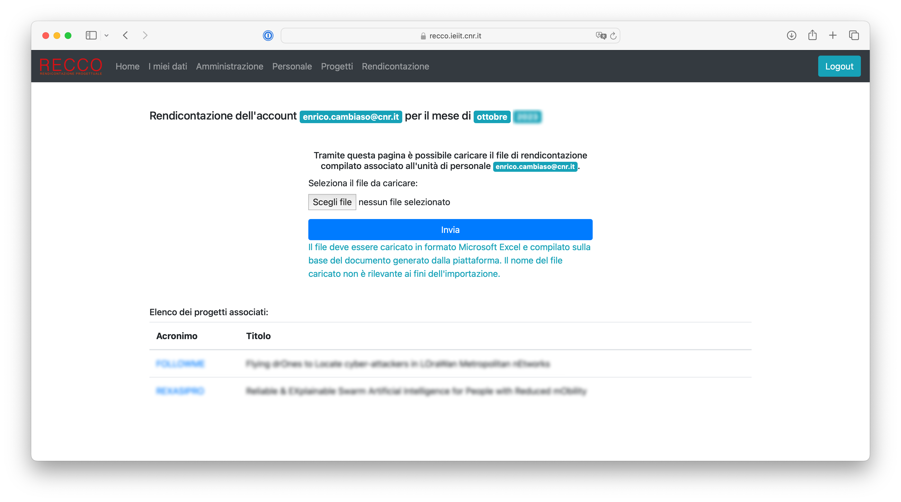

# Gestione degli aspetti di rendicontazione

La schermata di gestione degli aspetti di rendicontazione è riportata a seguire.
Occorre in particolare notare che non tutte le schede mostrate potrebbero essere disponibili, in base alla configurazione ed allo stato del sistema.

### Fogli orari compilati ###

Questa sezione permette la gestione dei fogli orari compilati dal personale coinvolto in attività di ricerca e registrati all'interno della piattaforma.

#### Consultazione dei fogli orari compilati ####

E' disponibile una scheda di dettaglio, dal titolo `Fogli orari compilati`, relativa ai fogli orari compilati per il periodo di riferimento corrente.

In particolare, la scheda mostra informazioni quali il numero di fogli orari compilati caricati sulla piattaforma, il numero massimo di fogli attesi, e la percentuale dei fogli caricati rispetto al totale.
Occorre considerare che una percentuale inferiore al 100% può indicare uno dei seguenti scenari:
* Una unità di personale non ha ore da rendicontare su alcun progetto per il periodo di riferimento corrente
* Una unità di personale non ha (ancora) caricato il foglio orario compilato sulla piattaforma

In quest'ultimo caso, è possibile, se la configurazione del sistema lo permette, ricordare alle unità di personale che non hanno ancora caricato il foglio orario, di caricarlo entro la scadenza (si veda la relativa sezione più avanti).

Cliccando il bottone `Visualizza documenti` è possibile consultare tutti i documenti caricati: per ogni documento è possibile scaricare lo stesso o eliminarlo.

Pertanto, per poter visualizzare i fogli orari compilati disponibili all'interno della piattaforma per il periodo di riferimento corrente, procedere come segue:
1. Accedere alla piattaforma RECCO
2. Aprire il menu `Rendicontazione`
3. Cliccare il bottone `Visualizza documenti` all'interno della scheda `Fogli orari compilati`
4. Si aprirà una pagina contenente tutti i documenti, con la possibilità di scaricarli o rimuoverli

#### Consultazione dell'archivio dei fogli orari compilati ####

Analogamente alla consultazione dei fogli orari compilati per il periodo di riferimento corrente, è disponibile una scheda di dettaglio relativa all'archivio di tutti i fogli orari compilati.
Tale scheda ha come titolo `Archivio fogli orari compilati`.

Cliccando il bottone `Visualizza documenti` è possibile selezionare il periodo di riferimento di interesse (espresso nel formato `YYYYMM`), dunque accedere ai documenti di interesse, con possibilità di scaricarli o eliminarli.

Pertanto, per poter visualizzare tutti i fogli orari compilati all'interno della piattaforma, procedere come segue:
1. Accedere alla piattaforma RECCO
2. Aprire il menu `Rendicontazione`
3. Cliccare il bottone `Visualizza documenti` all'interno della scheda `Archivio fogli orari compilati`
4. Si aprirà una pagina contenente tutti i periodi di riferimento, espressi nel formato `YYYYMM`
5. Selezionare il periodo di riferimento di interesse cliccando sul bottone `Visualizza`
6. Si aprirà una nuova pagina contenente tutti i documenti, con la possibilità di scaricarli o rimuoverli

#### Caricamento manuale dei fogli orari compilati ####

Se il sistema è configurato per permettere tale opzione, è possibile caricare manualmente i fogli orari (senza attendere la compilazione da parte delle relative unità di personale).
Per procedere in tal senso, cliccare il bottone `Carica documenti` all'interno della scheda `Caricamento fogli orari compilati`.

Verrà aperta una finestra analoga alla seguente.

*Schermata di visualizzazione delle unità di personale registrate per caricamento manuale dei fogli orari compilati*

In particolare, per ogni unità di personale, è possibile aprire la finestra di caricamento dei fogli orari cliccando sul relativo bottone `Visualizza`.

Tale finestra sarà analoga alla seguente.

*Schermata di visualizzazione delle unità di personale registrate per caricamento manuale dei fogli orari compilati*

Opzionalmente, in base alle configurazioni della piattaforma, verranno mostrati i progetti che vedono l'unità di personale di riferimento come partecipante.

Una volta aperta la finetra, è possibile caricare il foglio orario compilato, selezionandolo attraverso il relativo bottone `Scegli file` (da notare che il testo del bottone potrebbe variare in base al browser utilizzato), dunque cliccando il bottone `Invia`.

Una volta premuto il tasto di invio, comparirà una notifica di successo o di errore, in base al risultato di un pre-processamento del file caricato.
Ad esempio, un errore potrebbe essere dovuto al caricamento di un file con estensione differente rispetto a quella attesa.

Inoltre, il nome del file caricato non è rilevante ai fini dell'importazione, in quanto il file caricato verrà rinominato automaticamente dalla piattaforma.

E' importante notare che, se tale opzione è configurata, a caricamento avvenuto l'unità di personale coinvolta riceverà una email di conferma.
Inoltre, indipendentemente da tale configurazione, l'attività verrà registrata all'interno dei log della piattaforma, associando l'utente che ha caricato il file con l'operazione.

Il caricamento implica inoltre la generazione automatica dei timesheet relativi, come descritto relativamente al [processo implementato](introduzione.md#il-processo-implementato).

Riassumendo, per poter caricare manualmente il foglio orario compilato di un dipendente, ammesso che tale opzione sia possibile dalla configurazione della piattaforma, è necessario procedere come segue:
1. Accedere alla piattaforma RECCO
2. Aprire il menu `Rendicontazione`
3. Cliccare il bottone `Carica documenti` all'interno della scheda `Caricamento fogli orari compilati`
4. Si aprirà una finestra con la lista del personale registrato: cliccare il bottone `Visualizza` adiacente all'unità di personale di riferimento
5. Si aprirà una finestra di caricamento del foglio orario: cliccare il bottone `Scegli file`
6. Selezionare dal proprio computer il file da caricare, in formato Microsoft Excel
7. Cliccare il bottone `Invia` per confermare l'operazione
8. Verificare la finestra di notifica

#### Consultazione dei fogli orari compilati contenenti periodi in missione ####

Se il sistema è configurato per mostrare tale opzione, è possibile consultare i soli fogli orari compilati per il periodo di riferimento corrente che includono periodi in missione.
Tale funzionalità può essere utile per verificare in modo rapido eventuali anomalie sulle ore in missione rendicontate dal personale.

Per visualizzare i fogli orari compilati per il periodo di riferimento corrente contenenti periodi in missione, procedere come segue:
1. Accedere alla piattaforma RECCO
2. Aprire il menu `Rendicontazione`
3. Cliccare il bottone `Visualizza documenti` all'interno della scheda `Fogli orari contenenti missioni`
4. Si aprirà una pagina contenente tutti i documenti, con la possibilità di scaricarli

#### Invio di remind per la compilazione dei fogli orari ####

Se il sistema è configurato per permettere tale operazione, è possibile inviare un remind per la compilazione dei fogli orari al personale che ancora non ha caricato gli stessi.
Tale operazione è disponibile solamente se non è stato superato il tempo limite per il caricamento, configurato all'interno della piattaforma.
La scheda di riferimento ha titolo `Richiedi compilazione` e mostra il dettaglio del numero di unità di personale che non hanno caricato i fogli orari compilati al momento della consultazione.
Al click del bottone `Invia richiesta` interno alla scheda, verrà aperta una schermata analoga alla seguente.

*Schermata di conferma di invio di remind della compilazione di fogli orari*

L'esecuzione di tale operazione invierà, alle sole unità di personale che ancora non hanno caricato i documenti compilati, una email come quella inviata in fase di [produzione di fogli orari](utilizzo_gestionepersonale.md#produzione-di-fogli-orari).

Inoltre, verrà inviata una email di conferma all'utente che ha generato la richiesta.

Per procedere con l'invio del remind per la compilazione dei fogli orari verso il personale che non ha caricato i documenti compilati, procedere come segue:
1. Accedere alla piattaforma RECCO
2. Aprire il menu `Rendicontazione`
3. Cliccare il bottone `Invia richiesta` all'interno della scheda `Richiedi compilazione`
4. Si aprirà una schermata che mostra i dettagli sulle unità di personale che ancora non hanno caricato i fogli orari compilati sulla piattaforma, per il periodo di riferimento corrente
5. Cliccare il bottone `Conferma` per confermare l'operazione

### Timesheet ###

Questa sezione permette la gestione dei timesheet di rendicontazione mensili.

#### Gestione dei template dei timesheet mensili ####

Al fine di poter produrre un timesheet per un dato progetto, è necessario disporre di un template da utilizzare come base per la generazione del timesheet stesso.
Il template è rappresentato da un file in formato Microsoft Excel e dalle istruzioni relative al posizionamento dei diversi valori possibili all'interno dello stesso.

La gestione dei timesheet presenti all'interno della piattaforma avviene tramite il bottone `Gestisci template` all'interno della scheda `Template di timesheet disponibili`.
Al click del bottone, verrà aperta una finestra dedicata, volta a mostrare tutti i template registrati.

##### Consultazione dei template dei timesheet mensili disponibili #####

Come accennato in precedenza, è possibile consultare tutti i template dei timesheet mensili disponibili attraverso il bottone `Gestisci template` all'interno della scheda `Template di timesheet disponibili`.
Al click, verrà aperta una finestra analoga alla seguente.

*Finestra di visualizzazione dei template disponibili all'interno della piattaforma*

In particolare, per ogni template registrato, è possibile scaricare il file Microsoft Excel relativo, modificare le informazioni relative al template (incluso l'aggiornamento del file Microsoft Excel) o rimuovere il template.
E' inoltre possibile aggiungere un nuovo template.

Dunque, al fine di consultare i template dei timesheet mensili disponibili, procedere come segue:
1. Accedere alla piattaforma RECCO
2. Aprire il menu `Rendicontazione`
3. Cliccare il bottone `Gestisci template` all'interno della scheda `Template di timesheet disponibili`
4. Si aprirà una finestra che elenca i template registrati all'interno della piattaforma, con possibilità di operare su di essi o aggiungerne di nuovi

##### Consultazione delle informazioni relative ad un template dei timesheet mensili #####

La consultazione dei dati relativi ad un template considera due elementi differenti: da una parte, il template Microsoft Excel registrato, dall'altra, i dati ad esso associati, che coincidono con gli aspetti di configurazione della modalità di esportazione dei dati.

Per quest'ultimo caso, viene riportato un esempio di tali informazioni nella figura seguente.

*Schermata di visualizzazione delle informazioni relative ad un template dei timesheet mensili*

In particolare, per poter procedere con l'esportazione del documento del template Microsoft Excel registrato all'interno della piattaforma, è necessario eseguire le seguenti attività:
1. Accedere alla piattaforma RECCO
2. Aprire il menu `Rendicontazione`
3. Cliccare il bottone `Gestisci template` all'interno della scheda `Template di timesheet disponibili`
4. Si aprirà una finestra che elenca i template registrati all'interno della piattaforma
5. Cliccare il bottone `Download` adiacente al template di interesse per poter scaricare il documento Microsoft Excel del template stesso

Invece, al fine di consultare le informazioni di configurazione dell'esportazione correlate ad un template specifico, procedere come segue:
1. Accedere alla piattaforma RECCO
2. Aprire il menu `Rendicontazione`
3. Cliccare il bottone `Gestisci template` all'interno della scheda `Template di timesheet disponibili`
4. Si aprirà una finestra che elenca i template registrati all'interno della piattaforma
5. Cliccare il bottone `Modifica` adiacente al template di interesse
6. Si aprirà una schermata che mostra le informazioni relative al template
7. Consultare le informazioni, dunque, se non si intende effettuare alcuna modifica, premere il bottone `Chiudi` in fondo alla schermata

##### Modifica di un template dei timesheet mensili #####

TODO

##### Aggiunta di un template dei timesheet mensili #####

TODO

##### Rimozione di un template dei timesheet mensili #####

TODO

#### Produzione manuale di timesheet mensili ####

TODO

#### Consultazione dei timesheet mensili prodotti in formato Microsoft Excel ####

TODO

#### Archivio dei timesheet mensili prodotti in formato Microsoft Excel ####

TODO

#### Consultazione dei timesheet mensili prodotti in formato PDF ####

TODO

#### Archivio dei timesheet mensili prodotti in formato PDF ####

TODO

### Report testuali ###

TODO

#### Gestione dei template dei report testuali mensili ####

TODO

#### Produzione manuale di report testuali mensili ####

TODO

#### Consultazione dei report testuali mensili prodotti in formato Microsoft Word ####

TODO

#### Archivio dei report testuali mensili prodotti in formato Microsoft Work ####

TODO

#### Consultazione dei report testuali mensili prodotti in formato PDF ####

TODO

#### Archivio dei report testuali mensili prodotti in formato PDF ####

TODO