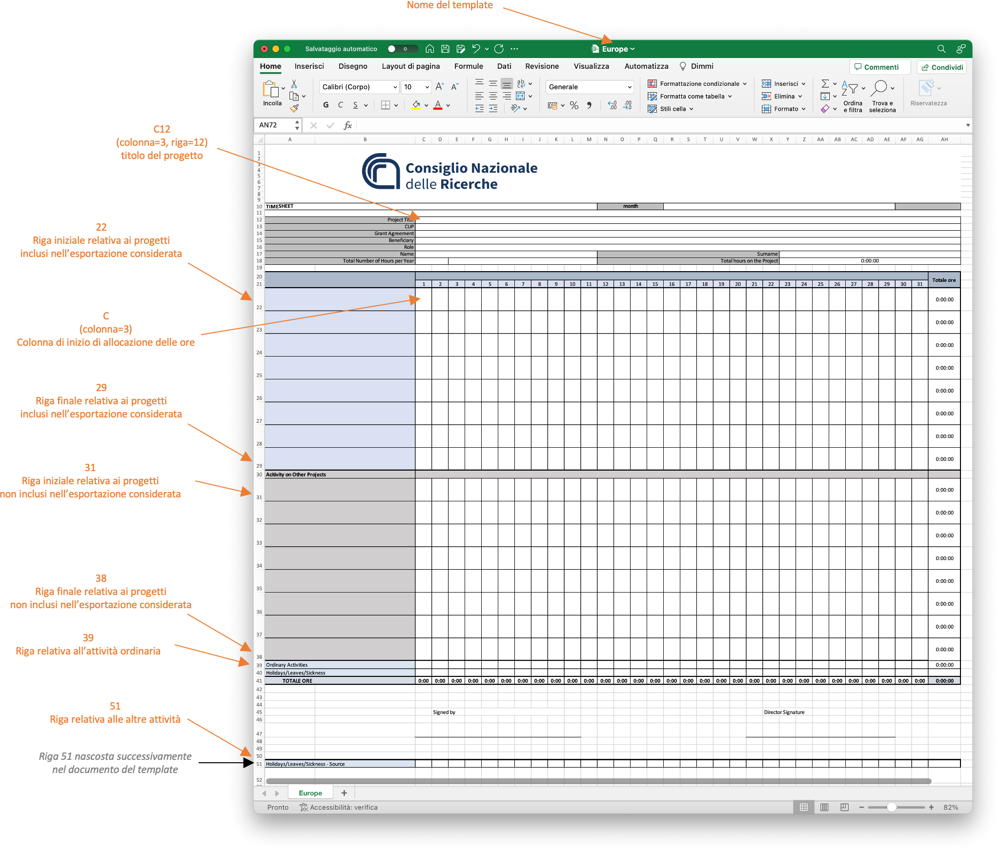

# Gestione degli aspetti di rendicontazione

La schermata di gestione degli aspetti di rendicontazione è riportata a seguire.
Occorre in particolare notare che non tutte le schede mostrate potrebbero essere disponibili, in base alla configurazione ed allo stato del sistema.


### Fogli orari compilati ###

Questa sezione permette la gestione dei fogli orari compilati dal personale coinvolto in attività di ricerca e registrati all'interno della piattaforma.

#### Consultazione dei fogli orari compilati ####

E' disponibile una scheda di dettaglio, dal titolo `Fogli orari compilati`, relativa ai fogli orari compilati per il periodo di riferimento corrente.

In particolare, la scheda mostra informazioni quali il numero di fogli orari compilati caricati sulla piattaforma, il numero massimo di fogli attesi, e la percentuale dei fogli caricati rispetto al totale.
Occorre considerare che una percentuale inferiore al 100% può indicare uno dei seguenti scenari:
* Una unità di personale non ha ore da rendicontare su alcun progetto per il periodo di riferimento corrente
* Una unità di personale non ha (ancora) caricato il foglio orario compilato sulla piattaforma

In quest'ultimo caso, è possibile, se la configurazione del sistema lo permette, ricordare alle unità di personale che non hanno ancora caricato il foglio orario, di caricarlo entro la scadenza (si veda la relativa sezione più avanti).

Cliccando il bottone `Visualizza documenti` è possibile consultare tutti i documenti caricati: per ogni documento è possibile scaricare lo stesso o eliminarlo.

Pertanto, per poter visualizzare i fogli orari compilati disponibili all'interno della piattaforma per il periodo di riferimento corrente, procedere come segue:
1. Accedere alla piattaforma RECCO
2. Aprire il menu `Rendicontazione`
3. Cliccare il bottone `Visualizza documenti` all'interno della scheda `Fogli orari compilati`
4. Si aprirà una pagina contenente tutti i documenti, con la possibilità di scaricarli o rimuoverli

#### Consultazione dell'archivio dei fogli orari compilati ####

Analogamente alla consultazione dei fogli orari compilati per il periodo di riferimento corrente, è disponibile una scheda di dettaglio relativa all'archivio di tutti i fogli orari compilati.
Tale scheda ha come titolo `Archivio fogli orari compilati`.

Cliccando il bottone `Visualizza documenti` è possibile selezionare il periodo di riferimento di interesse (espresso nel formato `YYYYMM`), dunque accedere ai documenti di interesse, con possibilità di scaricarli o eliminarli.

Pertanto, per poter visualizzare tutti i fogli orari compilati all'interno della piattaforma, procedere come segue:
1. Accedere alla piattaforma RECCO
2. Aprire il menu `Rendicontazione`
3. Cliccare il bottone `Visualizza documenti` all'interno della scheda `Archivio fogli orari compilati`
4. Si aprirà una pagina contenente tutti i periodi di riferimento, espressi nel formato `YYYYMM`
5. Selezionare il periodo di riferimento di interesse cliccando sul bottone `Visualizza`
6. Si aprirà una nuova pagina contenente tutti i documenti, con la possibilità di scaricarli o rimuoverli

#### Caricamento manuale dei fogli orari compilati ####

Se il sistema è configurato per permettere tale opzione, è possibile caricare manualmente i fogli orari (senza attendere la compilazione da parte delle relative unità di personale).
Per procedere in tal senso, cliccare il bottone `Carica documenti` all'interno della scheda `Caricamento fogli orari compilati`.

Verrà aperta una finestra analoga alla seguente.


*Schermata di visualizzazione delle unità di personale registrate per caricamento manuale dei fogli orari compilati*

In particolare, per ogni unità di personale, è possibile aprire la finestra di caricamento dei fogli orari cliccando sul relativo bottone `Visualizza`.

Tale finestra sarà analoga alla seguente.


*Schermata di visualizzazione delle unità di personale registrate per caricamento manuale dei fogli orari compilati*

Opzionalmente, in base alle configurazioni della piattaforma, verranno mostrati i progetti che vedono l'unità di personale di riferimento come partecipante.

Una volta aperta la finetra, è possibile caricare il foglio orario compilato, selezionandolo attraverso il relativo bottone `Scegli file` (da notare che il testo del bottone potrebbe variare in base al browser utilizzato), dunque cliccando il bottone `Invia`.

Una volta premuto il tasto di invio, comparirà una notifica di successo o di errore, in base al risultato di un pre-processamento del file caricato.
Ad esempio, un errore potrebbe essere dovuto al caricamento di un file con estensione differente rispetto a quella attesa.

Inoltre, il nome del file caricato non è rilevante ai fini dell'importazione, in quanto il file caricato verrà rinominato automaticamente dalla piattaforma.

E' importante notare che, se tale opzione è configurata, a caricamento avvenuto l'unità di personale coinvolta riceverà una email di conferma.
Inoltre, indipendentemente da tale configurazione, l'attività verrà registrata all'interno dei log della piattaforma, associando l'utente che ha caricato il file con l'operazione.

Il caricamento implica inoltre la generazione automatica dei timesheet relativi, come descritto relativamente al [processo implementato](introduzione.md#il-processo-implementato).

Riassumendo, per poter caricare manualmente il foglio orario compilato di un dipendente, ammesso che tale opzione sia possibile dalla configurazione della piattaforma, è necessario procedere come segue:
1. Accedere alla piattaforma RECCO
2. Aprire il menu `Rendicontazione`
3. Cliccare il bottone `Carica documenti` all'interno della scheda `Caricamento fogli orari compilati`
4. Si aprirà una finestra con la lista del personale registrato: cliccare il bottone `Visualizza` adiacente all'unità di personale di riferimento
5. Si aprirà una finestra di caricamento del foglio orario: cliccare il bottone `Scegli file`
6. Selezionare dal proprio computer il file da caricare, in formato Microsoft Excel
7. Cliccare il bottone `Invia` per confermare l'operazione
8. Verificare la finestra di notifica

#### Consultazione dei fogli orari compilati contenenti periodi in missione ####

Se il sistema è configurato per mostrare tale opzione, è possibile consultare i soli fogli orari compilati per il periodo di riferimento corrente che includono periodi in missione.
Tale funzionalità può essere utile per verificare in modo rapido eventuali anomalie sulle ore in missione rendicontate dal personale.

Per visualizzare i fogli orari compilati per il periodo di riferimento corrente contenenti periodi in missione, procedere come segue:
1. Accedere alla piattaforma RECCO
2. Aprire il menu `Rendicontazione`
3. Cliccare il bottone `Visualizza documenti` all'interno della scheda `Fogli orari contenenti missioni`
4. Si aprirà una pagina contenente tutti i documenti, con la possibilità di scaricarli

#### Invio di remind per la compilazione dei fogli orari ####

Se il sistema è configurato per permettere tale operazione, è possibile inviare un remind per la compilazione dei fogli orari al personale che ancora non ha caricato gli stessi.
Tale operazione è disponibile solamente se non è stato superato il tempo limite per il caricamento, configurato all'interno della piattaforma.
La scheda di riferimento ha titolo `Richiedi compilazione` e mostra il dettaglio del numero di unità di personale che non hanno caricato i fogli orari compilati al momento della consultazione.
Al click del bottone `Invia richiesta` interno alla scheda, verrà aperta una schermata analoga alla seguente.


*Schermata di conferma di invio di remind della compilazione di fogli orari*

L'esecuzione di tale operazione invierà, alle sole unità di personale che ancora non hanno caricato i documenti compilati, una email come quella inviata in fase di [produzione di fogli orari](utilizzo_gestionepersonale.md#produzione-di-fogli-orari).

Inoltre, verrà inviata una email di conferma all'utente che ha generato la richiesta.

Per procedere con l'invio del remind per la compilazione dei fogli orari verso il personale che non ha caricato i documenti compilati, procedere come segue:
1. Accedere alla piattaforma RECCO
2. Aprire il menu `Rendicontazione`
3. Cliccare il bottone `Invia richiesta` all'interno della scheda `Richiedi compilazione`
4. Si aprirà una schermata che mostra i dettagli sulle unità di personale che ancora non hanno caricato i fogli orari compilati sulla piattaforma, per il periodo di riferimento corrente
5. Cliccare il bottone `Conferma` per confermare l'operazione

### Timesheet ###

Questa sezione permette la gestione dei timesheet di rendicontazione mensili.

#### Gestione dei template dei timesheet mensili ####

Al fine di poter produrre un timesheet per un dato progetto, è necessario disporre di un template da utilizzare come base per la generazione del timesheet stesso.
Il template è rappresentato da un file in formato Microsoft Excel e dalle istruzioni relative al posizionamento dei diversi valori possibili all'interno dello stesso.

La gestione dei timesheet presenti all'interno della piattaforma avviene tramite il bottone `Gestisci template` all'interno della scheda `Template di timesheet disponibili`.
Al click del bottone, verrà aperta una finestra dedicata, volta a mostrare tutti i template registrati.

##### Consultazione dei template dei timesheet mensili disponibili #####

Come accennato in precedenza, è possibile consultare tutti i template dei timesheet mensili disponibili attraverso il bottone `Gestisci template` all'interno della scheda `Template di timesheet disponibili`.
Al click, verrà aperta una finestra analoga alla seguente.


*Finestra di visualizzazione dei template disponibili all'interno della piattaforma*

In particolare, per ogni template registrato, è possibile scaricare il file Microsoft Excel relativo, modificare le informazioni relative al template (incluso l'aggiornamento del file Microsoft Excel) o rimuovere il template.
E' inoltre possibile aggiungere un nuovo template.

Dunque, al fine di consultare i template dei timesheet mensili disponibili, procedere come segue:
1. Accedere alla piattaforma RECCO
2. Aprire il menu `Rendicontazione`
3. Cliccare il bottone `Gestisci template` all'interno della scheda `Template di timesheet disponibili`
4. Si aprirà una finestra che elenca i template registrati all'interno della piattaforma, con possibilità di operare su di essi o aggiungerne di nuovi

##### Informazioni associate ad un template di timesheet mensili #####

Come anticipato in precedenza, ogni template di timesheet mensili è rappresentato dai seguenti elementi:
* un documento Microsoft Excel, che rappresenta il documento di base da utilizzare in fase di creazione del timesheet
* un insieme di informazioni volte a specificare quali dati si intende esportare e dove, rispetto alla struttura del documento Microsoft Excel

Per quanto riguarda il documento Microsoft Excel, nel caso in cui questo contenga immagini raggruppate tra loro, è importante rimuoverle dal gruppo e/o inserire una singola immagine, per evitare che, per un apparente limite della libreria di esportazione utilizzata, venga esportata solamente la prima delle immagini del gruppo.

Invece, scopo delle informazioni strutturate, giusto per fare un esempio, è quello di definire, ad esempio, in quale cella inserire il nome dell'unità di personale di riferimento.

A titolo esplicativo, viene riportato un esempio di informazioni strutturate nella figura seguente.


*Schermata di visualizzazione delle informazioni relative ad un template dei timesheet mensili*

Queste informazioni sono fondamentali per la corretta generazione di timesheet e comprenderne al meglio la necessità è un aspetto di primaria importanza.
In particolare, le informazioni includono:
* il nome del template: si tratta di un nome univoco senza caratteri speciali, ereditato ed assegnato automaticamente a partire dal nome del file caricato
* aggiunta della sede: indica se l'output prodotto deve includere o meno dettagli relativi alla sede dell'istituto al quale l'unità di personale afferisce
* un parametro che indica se le l'output prodotto deve includere o meno celle con valori pari a zero (es. indicare le `0:00` ore lavorate)
* informazioni su indice di riga e di colonna per il titolo del progetto
* informazioni su indice di riga e di colonna per il CUP del progetto
* informazioni su indice di riga e di colonna per il codice del progetto
* informazioni su indice di riga e di colonna per il nome del soggetto (solitamente, il nome dell'istituto)
* informazioni su indice di riga e di colonna per il nome dell'unità di personale di riferimento
* informazioni su indice di riga e di colonna per il cognome dell'unità di personale di riferimento
* informazioni su indice di riga e di colonna per il nome completo (inteso come nome e cognome) dell'unità di personale di riferimento
* informazioni su indice di riga e di colonna per il codice fiscale dell'unità di personale di riferimento
* informazioni su indice di riga e di colonna per il ruolo dell'unità di personale di riferimento
* informazioni su indice di riga e di colonna per le ore annuali svolte (da contratto) dall'unità di personale di riferimento
* informazioni su indice di riga e di colonna per l'anno di riferimento
* informazioni su indice di riga e di colonna per il mese di riferimento
* informazioni su indice di riga e di colonna per il mese di riferimento, in formato testuale esteso
* informazioni sull'indice di colonna per il titolo dei progetti da includere, per per i progetti inclusi nell'esportazione condiderata
* informazioni su riga iniziale e finale relativa ai progetti da includere, per per i progetti inclusi nell'esportazione condiderata
* informazioni sull'indice di colonna di inizio di allocazione delle ore, relativo al primo giorno del mese, per i progetti inclusi nell'esportazione considerata
* informazioni sull'indice di colonna per il titolo degli altri progetti, per per i progetti non relativi all'esportazione condiderata
* informazioni su riga iniziale e finale relativa agli altri progetti, per per i progetti non relativi all'esportazione condiderata
* informazioni sull'indice di colonna di inizio di allocazione delle ore, relativo al primo giorno del mese, per i progetti non relativi all'esportazione considerata
* informazioni sull'indice di riga relativa all'attività ordinaria
* informazione sull'indice di colonna di inizio relativo all'attività ordinaria, relativo al primo giorno del mese
* informazioni sull'indice di riga relativa alle altre attività (es. ferie, malattie, permessi, ecc.)
* informazione sull'indice di colonna di inizio relativa alle altre attività (es. ferie, malattie, permessi, ecc.), relativo al primo giorno del mese
* il file del template da caricare (campo da lasciare vuoto, in caso di modifica di un template esistente, nel caso in cui non si intenda aggiornare il documento)

In particolare, occorre considerare che gli indici di riga e di colonna devono essere indicati come valori interi: ad esempio, la cella `C4` verrà indicata come colonna `3`, riga `4`.

Occorre inoltre considerare che è obbligatorio specificare tutti i campi. Nel caso in cui alcuni campi non siano necessari per lo specifico template, è possibile specificarne l'inserimento in righe/colonne nascoste.

Al fine di rendere più chiara la configurazione, vengono di seguito riportati alcuni possibili valori per un template di esempio.



*Esempio di associazione di alcune delle informazioni ad un template di timesheet mensile*

Occorre in particolare notare che l'associazione di valori per celle unite deve considerare la prima cella: ad esempio, se si ha una unione delle celle `C4:C10` e si intende inserire il titolo del progetto in tale insieme (unito) di celle, occorrerà obbligatoriamente fare riferimento alla cella `C4`, dunque, alla colonna `3` ed alla riga `4`.

Sulla base del template mostrato, la figura seguente riporta un esempio di output, con ulteriori dettagli.


*Esempio di output per un template di timesheet mensile*

E' possibile notare come le righe inutilizzate relative all'elenco dei progetti vengano nascoste in automatico in fase di esportazione.

Inoltre, per questo caso specifico, è stato deciso di mostrare le altre attività (es. ferie, malattie, permessi, ecc.) con una `X` al posto delle relative ore associate.
Siccome in fase di esportazione questo caso non è previsto, è stato deciso di mostrare le altre attività in una riga dedicata nascosta (riga `51`, visibile nella prima immagine, per motivi esplitativi), che includerà i relativi valori. Dunque, in riga `40`, per tutte le celle relative ai giorni del mese, è stata inserita una formula ad-hoc volta a convertire il valore originario in una `X`.
Ad esempio, in riferimento alla cella `C40`, una possibile formula potrebbe essere la seguente:
```
=SE(C51="";"";"X")
```

Tramite un approccio di questo tipo è possibile produrre report di svariate tipologie, in modo del tutto flessibile.

##### Consultazione delle informazioni relative ad un template dei timesheet mensili #####

La consultazione dei dati relativi ad un template considera due elementi differenti: da una parte, il template Microsoft Excel registrato, dall'altra, i dati ad esso associati, che coincidono con gli aspetti di configurazione della modalità di esportazione dei dati.

In particolare, per poter procedere con l'esportazione del documento del template Microsoft Excel registrato all'interno della piattaforma, è necessario eseguire le seguenti attività:
1. Accedere alla piattaforma RECCO
2. Aprire il menu `Rendicontazione`
3. Cliccare il bottone `Gestisci template` all'interno della scheda `Template di timesheet disponibili`
4. Si aprirà una finestra che elenca i template registrati all'interno della piattaforma
5. Cliccare il bottone `Download` adiacente al template di interesse per poter scaricare il documento Microsoft Excel del template stesso

Invece, al fine di consultare le informazioni di configurazione dell'esportazione correlate ad un template specifico, procedere come segue:
1. Accedere alla piattaforma RECCO
2. Aprire il menu `Rendicontazione`
3. Cliccare il bottone `Gestisci template` all'interno della scheda `Template di timesheet disponibili`
4. Si aprirà una finestra che elenca i template registrati all'interno della piattaforma
5. Cliccare il bottone `Modifica` adiacente al template di interesse
6. Si aprirà una schermata che mostra le informazioni relative al template
7. Consultare le informazioni, dunque, se non si intende effettuare alcuna modifica, premere il bottone `Chiudi` in fondo alla schermata

##### Aggiunta di un template dei timesheet mensili #####

E' possibile registrare un nuovo template dei timesheet mensili all'interno del sistema, tramite il bottone `Aggiungi template` all'interno della relativa pagina di gestione dei template.

Per aggiungere un nuovo template dei timesheet mensili, procedere come segue:
1. Accedere alla piattaforma RECCO
2. Aprire il menu `Rendicontazione`
3. Cliccare il bottone `Gestisci template` all'interno della scheda `Template di timesheet disponibili`
4. Cliccare il bottone `Aggiungi template` in fondo alla pagina
5. Si aprirà una finestra di aggiunta: inserire i dati secondo le necessità, facendo riferimento a quanto descritto in precedenza relativamente alle informazioni richieste
6. Cliccare il bottone `Conferma` per confermare l'operazione

##### Modifica di un template dei timesheet mensili #####

E' possibile modificare un template dei timesheet mensili presente all'interno del sistema, tramite il relativo bottone `Modifica` all'interno della pagina di gestione dei template.

Per modificare un template dei timesheet mensili, procedere come segue:
1. Accedere alla piattaforma RECCO
2. Aprire il menu `Rendicontazione`
3. Cliccare il bottone `Gestisci template` all'interno della scheda `Template di timesheet disponibili`
4. Cliccare il bottone `Modifica` adiacente al template da modificare
5. Si aprirà una finestra di modifica: modificare i dati secondo le necessità, facendo riferimento a [quanto descritto in precedenza](utilizzo_gestionerendicontazione.md#informazioni-associate-ad-un-template-di-timesheet-mensili) relativamente alle informazioni richieste
6. Cliccare il bottone `Conferma` per confermare l'operazione

##### Rimozione di un template dei timesheet mensili #####

E' possibile rimuovere un template dei timesheet mensili presente all'interno del sistema, tramite il relativo bottone `Rimuovi` all'interno della pagina di gestione dei template.

Per modificare un template dei timesheet mensili, procedere come segue:
1. Accedere alla piattaforma RECCO
2. Aprire il menu `Rendicontazione`
3. Cliccare il bottone `Gestisci template` all'interno della scheda `Template di timesheet disponibili`
4. Cliccare il bottone `Rimuovere` adiacente al template da modificare
5. Si aprirà una finestra di conferma: cliccare il bottone `Conferma` per confermare l'operazione

#### Produzione manuale di timesheet mensili ####

E' disponibile una scheda di dettaglio relativa alla produzione manuale di timesheet mensili per il periodo di riferimento corrente, come mostrato nella figura seguente.


*Scheda di dettaglio per la produzione manuale di timesheet mensili per il periodo di riferimento corrente*

Una volta cliccato il relativo bottone, verrà aperta una finestra di conferma, che chiederà il nominativo dell'unità di personale per la quale è necessario generare nuovi timesheet.


*Schermata di conferma di produzione manuale di timesheet mensili*

Una volta selezionato il nominativo di interesse e confermata l'operazione, verrà recuperato il foglio orario compilato per la persona di riferimento, dunque, interfacciandosi con la piattaforma [ePAS](https://epas.amministrazione.cnr.it) per il recupero di informazioni specifiche (es. il codice fiscale, informazione non memorizzata all'interno della piattaforma RECCO), verranno generati i timesheet relativi, eventualmente sostituendo quelli esistenti o rimuovendo quelli generati erroneamente (es. in precedenza il foglio orario compilato riportava ore su un progetto, non rendicontato all'interno del foglio aggiornato).

Al termine, se tale opzione è stata abilitata nelle configurazioni della piattaforma, l'unità di personale coinvolta riceverà una email per ogni timesheet generato (con eventuale allegato, se configurato), chiedendo di firmare lo stesso e caricare il documento aggiornato all'interno della piattaforma.
Inoltre, una email contenente lo stato dell'operazione verrà inviata all'utente che ha generato la richiesta.

Riassumendo, per procedere con la generazione manuale di timesheet mensili per il periodo di riferimento corrente, eseguire le seguenti operazioni:
1. Accedere alla piattaforma RECCO
2. Aprire il menu `Rendicontazione`
3. Cliccare il bottone `Genera timesheet` all'interno della scheda `Produzione timesheet`
4. Si aprirà una finestra di conferma: selezionare il nominativo dell'unità di personale per la quale occorre (ri)generare i timesheet mensili
5. Cliccare il bottone `Conferma` per confermare l'operazione
6. Attendere una email di successo o di errore
7. Verificare la correttezza dei file dei timesheet mensili per il periodo di riferimento corrente presenti sulla piattaforma relativamente all'unità di personale indicata

#### Consultazione dei timesheet mensili prodotti in formato Microsoft Excel ####

E' disponibile una scheda di dettaglio relativa ai timesheet mensili prodotti in formato sorgente (Microsoft Excel) per il periodo di riferimento corrente, come mostrato nella figura seguente.


*Scheda di dettaglio dei timesheet mensili prodotti in formato sorgente per il mese di riferimento corrente*

In particolare, la scheda mostra informazioni quali il numero di timesheet mensili prodotti.

Cliccando il bottone `Visualizza documenti` è possibile consultare tutti i documenti generati: per ogni documento è possibile scaricare lo stesso, sostituirlo o eliminarlo.

Pertanto, per poter visualizzare i timesheet mensili prodotti in formato sorgente per il periodo di riferimento corrente, procedere come segue:
1. Accedere alla piattaforma RECCO
2. Aprire il menu `Rendicontazione`
3. Cliccare il bottone `Visualizza documenti` all'interno della scheda `Timesheet prodotti`
4. Si aprirà una pagina contenente tutti i documenti, con la possibilità di scaricarli, sostituirli o rimuoverli

#### Sostituzione di un timesheet mensile in formato Microsoft Excel ####

Come descritto in precedenza, è possibile sostituire un timesheet mensile in formato sorgente (Microsoft Excel), accedendo all'elenco dei documenti prodotti tramite la scheda `Timesheet prodotti`, dunque utilizzando il bottone `Sostituisci` adiacente al documento da sostituire.
In caso di sostituzione, verrà richiesta una motivazione, come da figura seguente.


*Schermata di sostituzione di un timesheet mensile*

La motivazione inserita verrà esclusivamente registrata all'interno della piattaforma.
Inoltre, occorre considerare che il nome del file caricato non è rilevante ai fini del caricamento.
Infine, una volta sostituito correttamente un documento, non sarà più possibile recuperare il documento originario. 

Pertanto, per poter sostituire un timesheet mensile prodotto in formato sorgente per il periodo di riferimento corrente, procedere come segue:
1. Accedere alla piattaforma RECCO
2. Aprire il menu `Rendicontazione`
3. Cliccare il bottone `Visualizza documenti` all'interno della scheda `Timesheet prodotti`
4. Si aprirà una pagina contenente tutti i documenti
5. Cliccare il bottone `Sostituisci` adiacente al documento da sostituire
6. Si aprirà una finestra: compilare i campi come richiesto
7. Confermare l'operazione cliccando il bottone `Conferma`

#### Consultazione dell'archivio dei timesheet mensili prodotti in formato Microsoft Excel ####

Analogamente alla consultazione dei timesheet mensili prodotti in formato sorgente (Microsoft Excel) per il periodo di riferimento corrente, è disponibile una scheda di dettaglio relativa all'archivio di tutti i timesheet mensili prodotti in formato sorgente, come mostrato nella figura seguente.


*Scheda di dettaglio dell'archivio dei timesheet mensili prodotti in formato sorgente per il mese di riferimento corrente*

Cliccando il bottone `Visualizza documenti` è possibile selezionare il periodo di riferimento di interesse (espresso nel formato `YYYYMM`), dunque accedere ai documenti di interesse, con possibilità di scaricarli, sostituirli o eliminarli.

Pertanto, per poter visualizzare tutti i timesheet mensili in formato sorgente presenti all'interno della piattaforma, procedere come segue:
1. Accedere alla piattaforma RECCO
2. Aprire il menu `Rendicontazione`
3. Cliccare il bottone `Visualizza documenti` all'interno della scheda `Archivio timesheet`
4. Si aprirà una pagina contenente tutti i periodi di riferimento, espressi nel formato `YYYYMM`
5. Selezionare il periodo di riferimento di interesse cliccando sul bottone `Visualizza`
6. Si aprirà una nuova pagina contenente tutti i documenti, con la possibilità di scaricarli, sostituirli o rimuoverli

#### Consultazione dei timesheet mensili prodotti in formato PDF ####

E' disponibile una scheda di dettaglio relativa ai timesheet mensili prodotti in formato PDF per il periodo di riferimento corrente.
Questi documenti vengono prodotti, se tale opzione è abilitata nella configurazione della piattaforma e se l'ambiente utilizzato è compatibile, a partire dai timesheet mensili in formato Microsoft Excel.
La figura seguente mostra nel dettaglio la scheda di interesse.


*Scheda di dettaglio dei timesheet mensili prodotti in formato PDF per il mese di riferimento corrente*

In particolare, la scheda mostra informazioni quali il numero di timesheet PDF mensili prodotti.

Cliccando il bottone `Visualizza documenti` è possibile consultare tutti i documenti generati: per ogni documento è possibile scaricare lo stesso.

Pertanto, per poter visualizzare i timesheet mensili prodotti in formato PDF per il periodo di riferimento corrente, procedere come segue:
1. Accedere alla piattaforma RECCO
2. Aprire il menu `Rendicontazione`
3. Cliccare il bottone `Visualizza documenti` all'interno della scheda `Timesheet prodotti in PDF`
4. Si aprirà una pagina contenente tutti i documenti, con la possibilità di scaricarli

#### Consultazione dell'archivio dei timesheet mensili prodotti in formato PDF ####

Analogamente alla consultazione dei timesheet mensili prodotti in formato PDF per il periodo di riferimento corrente, è disponibile una scheda di dettaglio relativa all'archivio di tutti i timesheet mensili prodotti in formato PDF, come mostrato nella figura seguente.


*Scheda di dettaglio dell'archivio dei timesheet mensili prodotti in formato sorgente per il mese di riferimento corrente*

Cliccando il bottone `Visualizza documenti` è possibile selezionare il periodo di riferimento di interesse (espresso nel formato `YYYYMM`), dunque accedere ai documenti di interesse, con possibilità di scaricarli, sostituirli o eliminarli.

Pertanto, per poter visualizzare tutti i timesheet mensili in formato PDF presenti all'interno della piattaforma, procedere come segue:
1. Accedere alla piattaforma RECCO
2. Aprire il menu `Rendicontazione`
3. Cliccare il bottone `Visualizza documenti` all'interno della scheda `Archivio timesheet in PDF`
4. Si aprirà una pagina contenente tutti i periodi di riferimento, espressi nel formato `YYYYMM`
5. Selezionare il periodo di riferimento di interesse cliccando sul bottone `Visualizza`
6. Si aprirà una nuova pagina contenente tutti i documenti, con la possibilità di scaricarli

### Report testuali ###

I report testuali sono report generati a partire da un documento Microsoft Word e associati ad uno o più progetti specifici.
Questa tipologia di report può essere particolarmente utile per alcune tipologie di progetti specifici (si faccia ad esempio riferimento ai documenti DSAN richiesti per i progetti PNRR).
La generazione di questi report è esclusivamente manuale ed i concetti alla base della gestione di questa tipologia di documenti sono analoghi a quanto descritto relativamente al [processo di gestione ed esportazione dei timesheet](utilizzo_gestionerendicontazione.md#timesheet).

#### Gestione dei template dei report testuali mensili ####

Al fine di poter produrre un report testuale mensile per un dato progetto o un insieme di progetti, è necessario disporre di un template da utilizzare come base per la generazione del documento.
Il template è rappresentato da un file in formato Microsoft Word.
Tale template conterrà al suo interno specifici tag, che verranno sostituiti in fase di generazione dei documenti, secondo determinate regole.

La gestione dei report testuali mensili presenti all'interno della piattaforma avviene tramite il bottone `Gestisci template` all'interno della scheda `Template di report testuali disponibili`.
Al click del bottone, verrà aperta una finestra dedicata, volta a mostrare tutti i template registrati.

##### Consultazione dei template dei report testuali mensili disponibili #####

Come accennato in precedenza, è possibile consultare tutti i template dei report testuali mensili disponibili attraverso il bottone `Gestisci template` all'interno della scheda `Template di report testuali disponibili`.


*Scheda di dettaglio per la gestione dei report testuali*

Al click, verrà aperta una finestra analoga alla seguente.


*Finestra di visualizzazione dei template disponibili all'interno della piattaforma*

In particolare, per ogni template registrato, è possibile scaricare il file Microsoft Excel relativo, modificare le informazioni relative al template (incluso l'aggiornamento del file Microsoft Excel) o rimuovere il template.
E' inoltre possibile aggiungere un nuovo template.

Dunque, al fine di consultare i template dei report testuali mensili disponibili, procedere come segue:
1. Accedere alla piattaforma RECCO
2. Aprire il menu `Rendicontazione`
3. Cliccare il bottone `Gestisci template` all'interno della scheda `Template di report testuali disponibili`
4. Si aprirà una finestra che elenca i template registrati all'interno della piattaforma, con possibilità di operare su di essi o aggiungerne di nuovi

##### Informazioni associate ad un template di report testuali mensili #####

Come anticipato in precedenza, ogni template di report testuali mensili è rappresentato da un documento Microsoft Word, che rappresenta il documento di base da utilizzare in fase di creazione del report.
Al fine di evitare eventuali errori o imprecisioni in fase di generazione dei report, si suggerisce di utilizzare il template di "report testuale base" fornito, come riportato nell'immagine a seguire (notare in particolare il testo in blu: una volta cliccato, verrà scaricato il template base da utilizzare).


*Scheda di dettaglio per la gestione dei report testuali*

Il nome del file del template (esclusa l'estensione del file stesso) che identifica un template verrà utilizzato come filtro per selezionare i progetti per i quali va utilizzato quello specifico template, in base all'acronimo del progetto o del progetto principale.
Ad esempio, se il file del template ha nome `APROJECT.docx`, l'output generato includerà i dati del progetto con acronimo `APROJECT` o, nel caso in cui tale acronimo sia associato ad un progetto principale (es. eventualmente suddiviso in Work Packages/Obiettivi Realizzativi/Spoke), l'output generato includerà tutti i dati dei sotto-progetti che hanno specificato `APROJECT` come progetto principale.

Inoltre, come menzionato in precedenza, è necessario aggiungere uno più tra i tag permessi all'interno del documento utilizzato come template.
Tali tag vanno inseriti in modo opportuno all'interno del documento, laddove sia necessario inserire i relativi oggetti.
In particolare, sono ammessi i seguenti tag:
* `{MONTH}` identifica il mese di riferimento in formato numerico
* `{MONTHNAME}` identifica il mese di riferimento in formato testuale
* `{YEAR}`0 identifica l'anno di riferimento
* `{TABLE_PNRR}` identifica la tabella da inserire secondo il formato richiesto dai progetti PNRR; opzionalmente, è possibile definire una specifica nella forma `{TABLE_PNRR:OPZIONE1+OPZIONE2+...}` per esportare colonne specifiche, dove le opzioni permesse sono le seguenti:
  * `LEVELTYPE` identifica il livello dell'unità di personale
  * `COSTS` identifica i costi per l'unità di personale
  * `YEARLYHOURS` identifica la quantità di ore annuali che l'unità di personale deve lavorare, da contratto
  * `MILESTONES` identifica le milestones di progetto (questa colonna verrà compilata come vuota, non essendo disponibile l'informazione all'interno della piattaforma)

A titolo di esempio, relativamente al tag `{TABLE_PNRR}`, nel caso in cui si intendano esportare, ad esempio, informazioni sul livello dell'unità di personale ed i costi, occorrerà specificare all'interno del documento del template il seguente tag:

```
{TABLE_PNRR:LEVELTYPE+COSTS}
```

Comprendere al meglio la necessità di questi tag è un aspetto di primaria importanza.
Occorre considerare che i tag utilizzati supportano ad oggi principalmente informazioni richieste da progetti PNRR ed ai relativi documenti DSAN.

Tramite un approccio di questo tipo è possibile produrre report di svariate tipologie, in modo del tutto flessibile.

##### Aggiunta di un template di report testuali mensili #####

TODO

##### Modifica di un template di report testuali mensili #####

TODO

##### Rimozione di un template di report testuali mensili #####

TODO

#### Produzione manuale di report testuali mensili ####

TODO

#### Consultazione dei report testuali mensili prodotti in formato Microsoft Word ####

TODO

#### Archivio dei report testuali mensili prodotti in formato Microsoft Work ####

TODO

#### Consultazione dei report testuali mensili prodotti in formato PDF ####

TODO

#### Archivio dei report testuali mensili prodotti in formato PDF ####

TODO