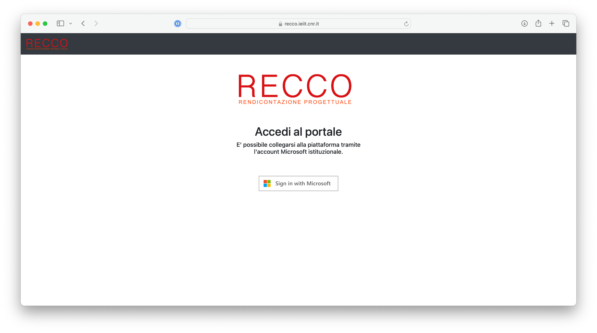
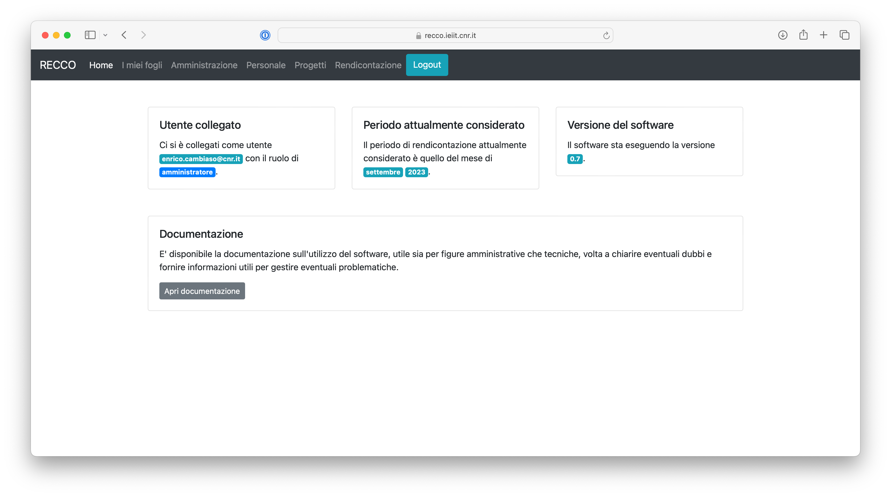
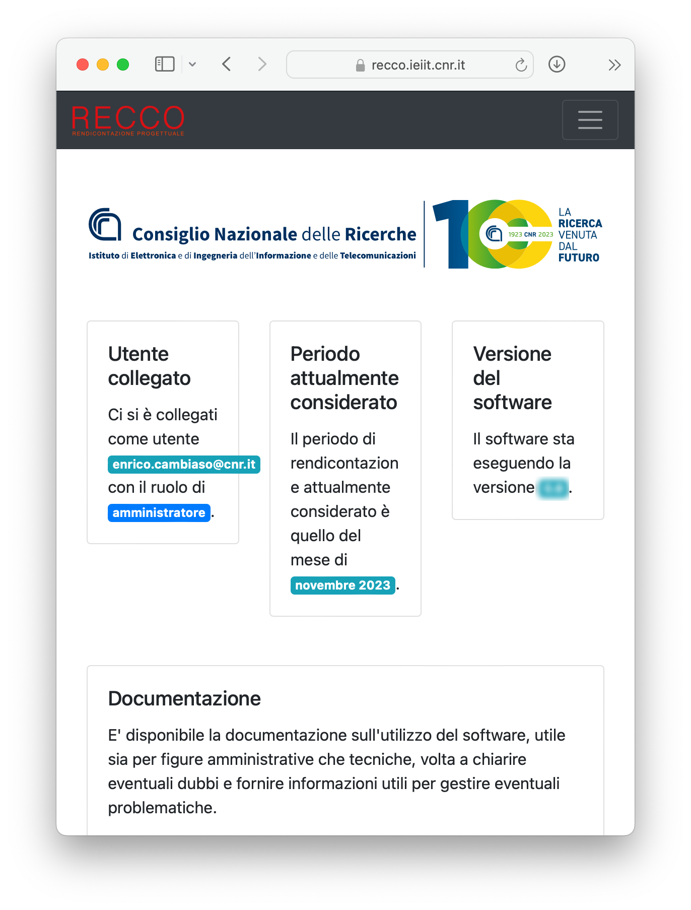
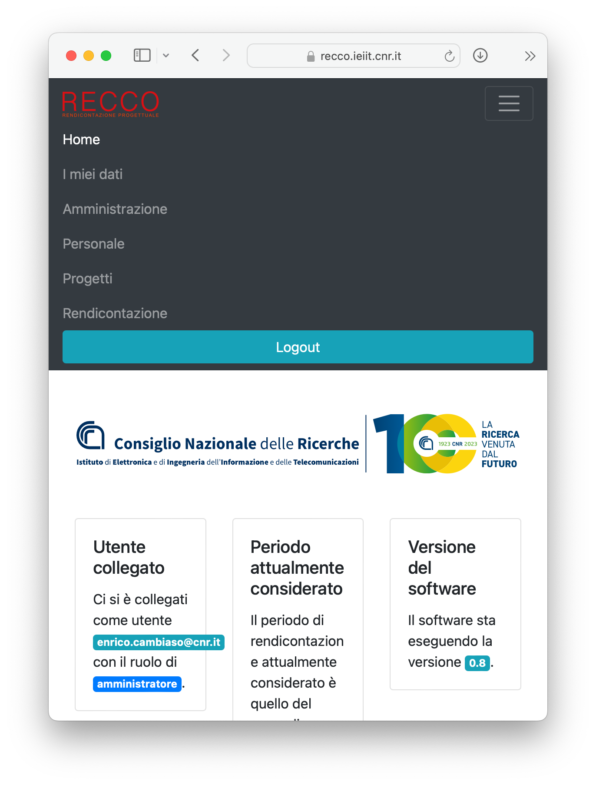
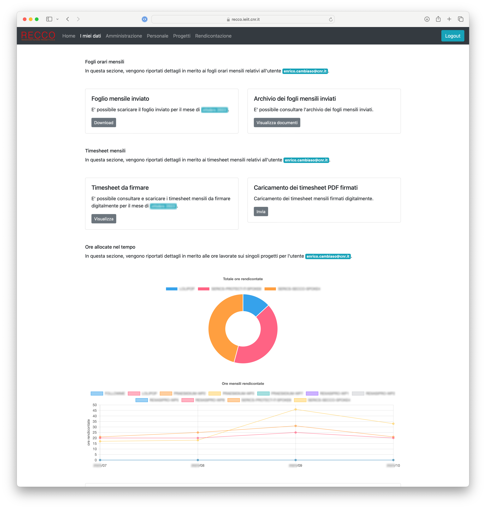
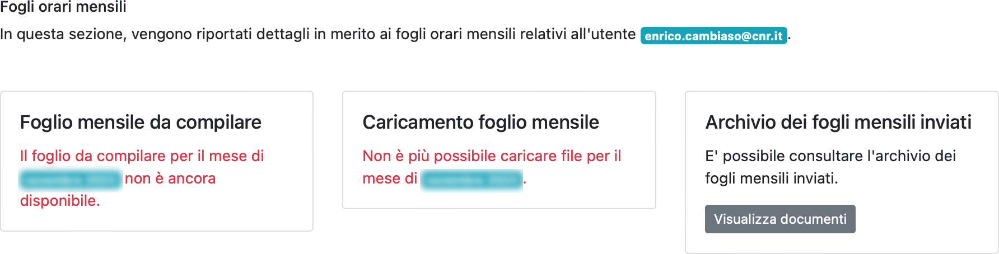
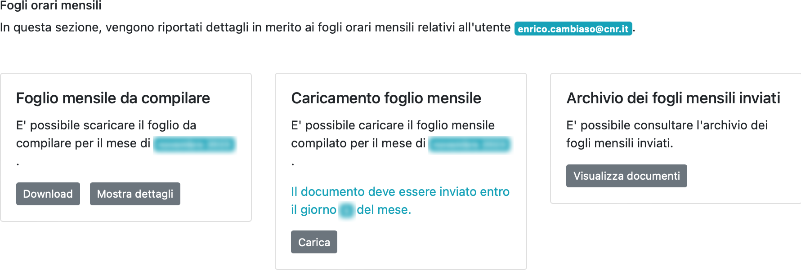
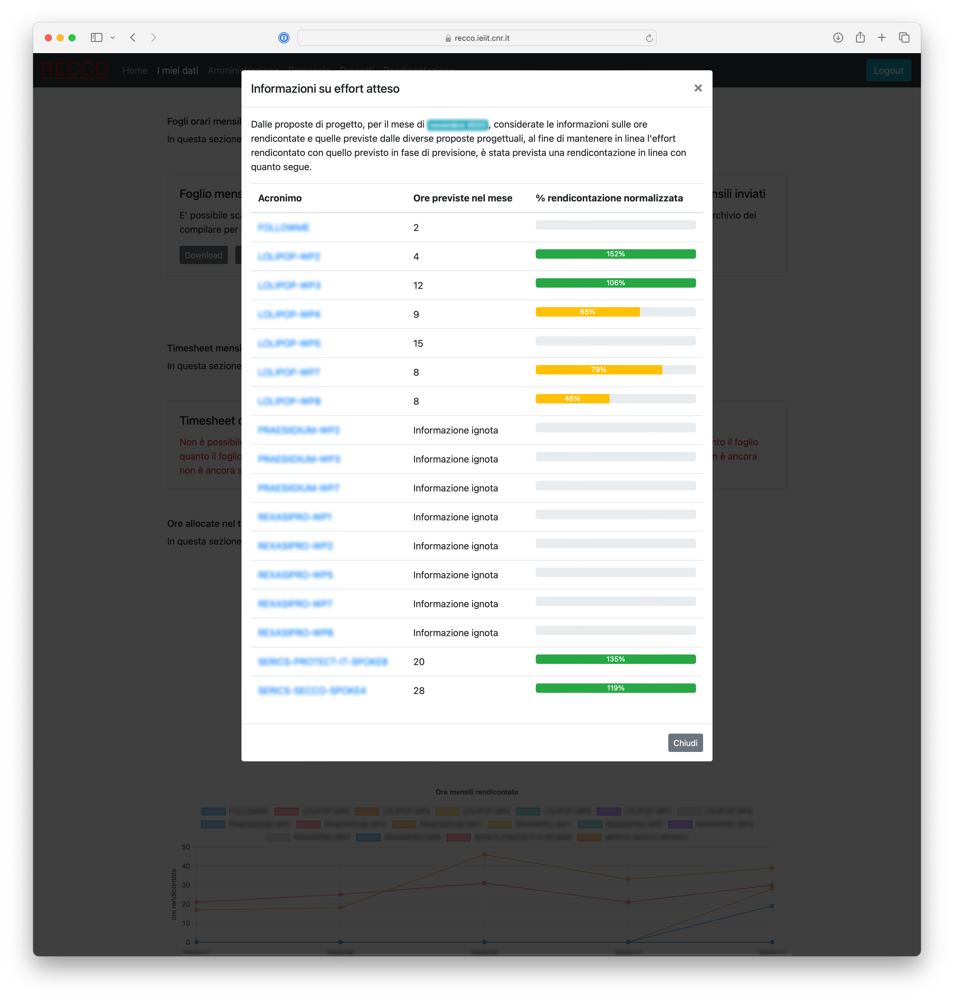
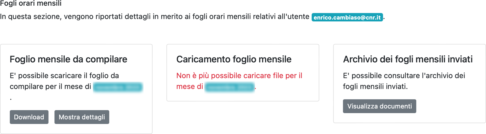
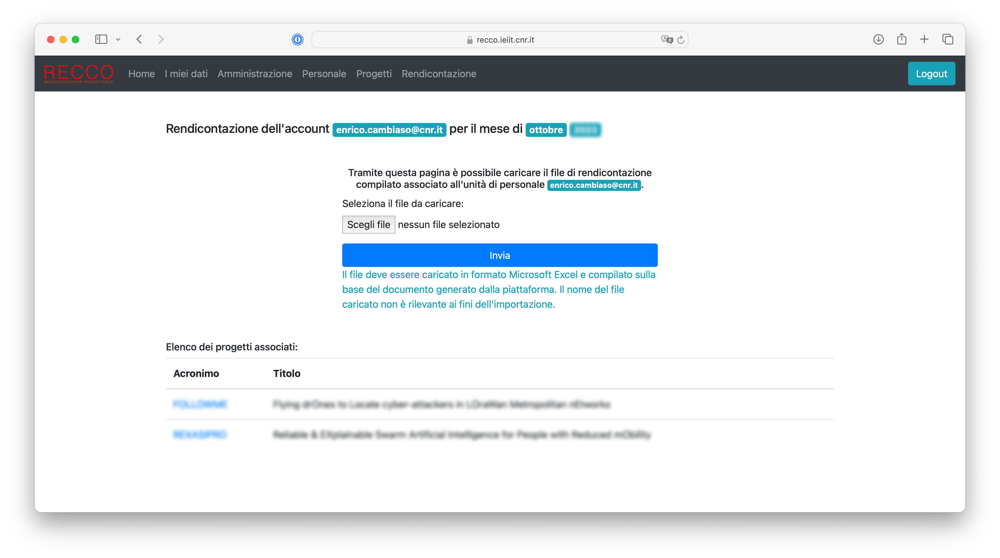

# Accesso come unità di personale coinvolta in attività di ricerca

La piattaforma RECCO fornisce alle unità di personale coinvolte in attività di ricerca la possibilità di:
* comunicare in modo agevole informazioni sulle ore rendicontate sui propri progetti (consultare la sezione dedicata alla [comunicazione delle ore rendicontate](comunicazioneorerendicontate.md)),
* monitorare l'allocazione delle ore personali per i diversi progetti (consultare la sezione dedicata al [monitoraggio delle proprie ore rendicontate](monitoraggioorerendicontate.md)),
* monitorare e pianificare la rendicontazione delle ore per i progetti per i quali si assume il ruolo di Principal Investigator (consultare la sezione dedicata alla [pianificazione della rendicontazione progettuale](pianificazioneprogettuale.md)).

In seguito viene descritta nel dettaglio l'interfaccia di gestione della piattaforma da parte delle unità di personale coinvolte in attività di ricerca.

### Accesso alla piattaforma RECCO ###

L'accesso alla piattaforma RECCO avviene attraverso il link di istituto fornito ed è concesso solo alle unità di personale abilitate.

Una volta aperta la pagina principale, viene mostrata una interfaccia analoga a quella mostrata in figura (da notare che, a titolo di esempio, in figura si fa riferimento al dominio RECCO per l'istituto [CNR-IEIIT](https://www.ieiit.cnr.it)).

L'autenticazione avviene a seguito del click sul bottone `Sign in with Microsoft`, sfruttando le credenziali Microsoft fornite dall'Ente.

### Interfaccia principale ###

Una volta autenticati, sarà disponibile una interfaccia analoga alla seguente.

L'interfaccia mostra informazioni quali:
* il logo dell'istituto di riferimento: se cliccato, verrà aperta la pagina web dell'istituto
* informazioni sull'utente collegato e sul relativo ruolo all'interno della piattaforma
* il periodo di riferimento attualmente considerato, sempre coincidente con il mese precedente a quello corrente
* la versione del software della piattaforma in esecuzione
* un link alla documentazione del software della piattaforma

Inoltre, nella parte alta della pagina, è disponibile un menu che mostra (in base al proprio ruolo) le diverse opzioni disponibili: tipicamente, per le unità di personale che non hanno compiti di gestione e mantenimento della piattaforma, sono disponibili i menu `Home`, `I miei dati`, `Progetti`.

Occorre notare che in versione mobile questo menu potrebbe assumere una forma differente, come mostrato in figura seguente.

In questo caso, per poter accedere il menu, occorre premere il bottone in alto sulla destra, che aprirà un menu in visualizzazione come elenco.

### Interfaccia "I miei dati" ###

Questa interfaccia rappresenta la schermata principale per la gestione ed il controllo delle proprie informazioni di rendicontazione.

Come mostrato in figura, l'interfaccia include in particolare tre sezioni, relative a:
* fogli orari mensili
* timesheet mensili
* ore allocate nel tempo nei vari progetti di ricerca

Vengono di seguito analizzate tutte le sezioni menzionate.

#### Fogli orari mensili ####

Questa sezione della pagina assume diverse forme, in base allo stato attuale dei propri fogli orari mensili.

In particolare, ad inizio mese, quando i fogli mensili non sono ancora stati generati per il periodo di riferimento corrente, viene mostrata una interfaccia analoga a quella mostrata nella figura seguente.

*Interfaccia dei fogli orari mensili a inizio mese, quando i fogli mensili non sono ancora stati generati*

Come è possibile notare, l'interfaccia non offre la possibilità di caricare alcun documento, né di caricarne la versione compilata, ad eccezzione dell'accesso a documenti dei fogli mensili registrati nell'archivio, antecedenti al periodo di riferimento corrente.

Dunque, a seguito della generazione dei timesheet da parte delle unità di personale dedicate a tale attività, viene mostrata una interfaccia analoga alla seguente.

*Interfaccia dei fogli orari mensili, con possibile di caricamento del documento compilato*

In questo caso è possibile scaricare il foglio orario mensile da compilare, mostrare eventuali dettagli utili a fini di redicontazione, caricare il documento compilato e, come in precedenza, accedere all'archivio storico dei documenti compilati.

Relativamente ai dettagli di rendicontazione, se abilitati dalla piattaforma, questi permettono di mostrare, per ogni progetto al quale l'unità di personale partecipa durante il periodo di riferimento corrente, informazioni sulla previsione dell'effort atteso da proposta, secondo quanto stimato ed indicato dal Principal Investigator.
Un esempio di schermata viene mostrato in figura seguente.

*Schermata con le informazioni sulle ore di rendicontazione previste, in base a quanto stimato dal Principal Investigator*

In particolare, come mostrato in figura, non tutte le informazioni potrebbero essere disponibili: essendo la compilazione di tali informazioni richiesta nei confronti dei Principal Investigator dei vari progetti, in caso di mancata compilazione, le informazioni non saranno disponibili.
Per altri casi, è possibile consultare, insieme alla stima delle ore previste per il mese corrente, anche l'andamento della rendicontazione per l'intero progetto, sotto forma di valore percentuale (da notare che un valore superiore al 100% indica che si è lavorato di più sul progetto rispetto alle previsioni; analogo discorso per valori inferiori al 100%).

Nel caso in cui non sia stato caricato alcun documento entro la scadenza, viene mostrata una schermata analoga alla seguente, che non offre la possibilità di caricare il documento compilato.

*Interfaccia dei fogli orari mensili, con impossibilità di caricamento del documento compilato oltre la scadenza*

Diversamente, se il documento compilato è stato caricato correttamente, viene mostrata una schermata simile alla seguente, con la possibilità di scaricare il documento compilato.
Se tale opzione è abilitata, e se la data prevista per il caricamento dei fogli orari compilati non è passata, è possibile caricare una versione aggiornata del documento.

*Interfaccia dei fogli orari mensili, a seguito del caricamento del documento compilato, con eventuale possibilità di aggiornare il documento entro la scadenza*

Per dettagli in merito a come sia possibile eseguire le operazioni menzionate, consultare la sezione dedicata alla [comunicazione delle ore rendicontate](comunicazioneorerendicontate.md).

#### Caricamento dei fogli orari compilati ####

Il caricamento del foglio orario compilato avviene tramite una pagina web dedicata, mostrata in seguito.
Opzionalmente, in base alle configurazioni della piattaforma, verranno mostrati i progetti che vedono l'unità di personale di riferimento come partecipante.
Inoltre, in caso di superamento della scadenza prevista per il caricamento dei dati, non sarà possibile caricare alcun documento.
Similmente, se la piattaforma è stata configurata per non permettere caricamenti multipli dei documenti, una volta caricato il documento, non sarà più possibile caricarne nuove versioni.

*Schermata di caricamento dei fogli orari compilati*

Una volta aperta la finestra, è possibile caricare il foglio orario compilato, selezionandolo attraverso il relativo bottone `Scegli file` (da notare che il testo del bottone potrebbe variare in base al browser utilizzato), dunque cliccando il bottone `Invia`.

Una volta premuto il tasto di invio, comparirà una notifica di successo o di errore, in base al risultato di un pre-processamento del file caricato.
Ad esempio, un errore potrebbe essere dovuto al caricamento di un file con estensione differente rispetto a quella attesa.

Inoltre, il nome del file caricato non è rilevante ai fini dell'importazione, in quanto il file caricato verrà rinominato automaticamente dalla piattaforma.

E' importante notare che, se tale opzione è configurata, a caricamento avvenuto l'unità di personale coinvolta riceverà una email di conferma.

A caricamento ultimato, verranno generati automaticamente i timesheet relativi, come descritto relativamente al [processo implementato](introduzione.md#il-processo-implementato).

#### Timesheet mensili ####

TODO

### Ore allocate nel tempo ####

TODO

### Interfaccia "Progetti" ###

TODO
