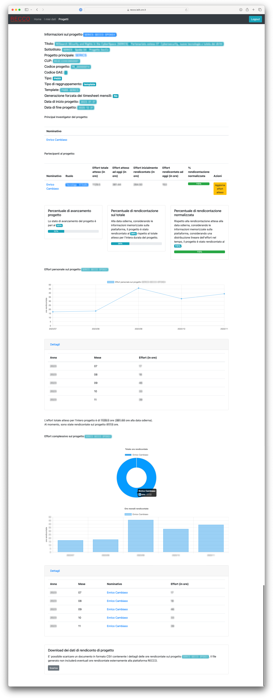

# Accesso come unità di personale coinvolta in attività di ricerca

La piattaforma RECCO fornisce alle unità di personale coinvolte in attività di ricerca la possibilità di:
* comunicare in modo agevole informazioni sulle ore rendicontate sui propri progetti (consultare la sezione dedicata alla [comunicazione delle ore rendicontate](comunicazioneorerendicontate.md)),
* monitorare l'allocazione delle ore personali per i diversi progetti (consultare la sezione dedicata al [monitoraggio delle proprie ore rendicontate](monitoraggioorerendicontate.md)),
* monitorare e pianificare la rendicontazione delle ore per i progetti per i quali si assume il ruolo di Principal Investigator (consultare la sezione dedicata alla [pianificazione della rendicontazione progettuale](pianificazioneprogettuale.md)).

In seguito viene descritta nel dettaglio l'interfaccia di gestione della piattaforma da parte delle unità di personale coinvolte in attività di ricerca.

### Accesso alla piattaforma RECCO ###

L'accesso alla piattaforma RECCO avviene attraverso il link di istituto fornito ed è concesso solo alle unità di personale abilitate.

Una volta aperta la pagina principale, viene mostrata una interfaccia analoga a quella mostrata in figura (da notare che, a titolo di esempio, in figura si fa riferimento al dominio RECCO per l'istituto [CNR-IEIIT](https://www.ieiit.cnr.it)).


L'autenticazione avviene a seguito del click sul bottone `Sign in with Microsoft`, sfruttando le credenziali Microsoft fornite dall'Ente.

### Interfaccia principale ###

Una volta autenticati, sarà disponibile una interfaccia analoga alla seguente (da notare che non tutte le opzioni del menu potrebbero essere disponibile, in base ai permessi associati all'utente autenticato).


L'interfaccia mostra informazioni quali:
* il logo dell'istituto di riferimento: se cliccato, verrà aperta la pagina web dell'istituto
* informazioni sull'utente collegato e sul relativo ruolo all'interno della piattaforma
* il periodo di riferimento attualmente considerato, sempre coincidente con il mese precedente a quello corrente
* la versione del software della piattaforma in esecuzione
* un link alla documentazione del software della piattaforma

Inoltre, nella parte alta della pagina, è disponibile un menu che mostra (in base al proprio ruolo) le diverse opzioni disponibili: tipicamente, per le unità di personale che non hanno compiti di gestione e mantenimento della piattaforma, sono disponibili i menu `Home`, `I miei dati`, `Progetti`.

Occorre notare che in versione mobile questo menu potrebbe assumere una forma differente, come mostrato in figura seguente.


In questo caso, per poter accedere il menu, occorre premere il bottone in alto sulla destra, che aprirà un menu in visualizzazione come elenco.


### Interfaccia "I miei dati" ###

Questa interfaccia rappresenta la schermata principale per la gestione ed il controllo delle proprie informazioni di rendicontazione.


Come mostrato in figura, l'interfaccia include in particolare tre sezioni, relative a:
* fogli orari mensili
* timesheet mensili
* ore allocate nel tempo nei vari progetti di ricerca

Vengono di seguito analizzate tutte le sezioni menzionate.

#### Fogli orari mensili ####

Questa sezione della pagina assume diverse forme, in base allo stato attuale dei propri fogli orari mensili.

In particolare, ad inizio mese, quando i fogli mensili non sono ancora stati generati per il periodo di riferimento corrente, viene mostrata una interfaccia analoga a quella mostrata nella figura seguente.


*Interfaccia dei fogli orari mensili a inizio mese, quando i fogli mensili non sono ancora stati generati*

Come è possibile notare, l'interfaccia non offre la possibilità di caricare alcun documento, né di caricarne la versione compilata, ad eccezzione dell'accesso a documenti dei fogli mensili registrati nell'archivio, antecedenti al periodo di riferimento corrente.

Dunque, a seguito della generazione dei timesheet da parte delle unità di personale dedicate a tale attività, viene mostrata una interfaccia analoga alla seguente.


*Interfaccia dei fogli orari mensili, con possibile di caricamento del documento compilato*

In questo caso è possibile scaricare il foglio orario mensile da compilare, mostrare eventuali dettagli utili a fini di redicontazione, caricare il documento compilato e, come in precedenza, accedere all'archivio storico dei documenti compilati.

Relativamente ai dettagli di rendicontazione, se abilitati dalla piattaforma, questi permettono di mostrare, per ogni progetto al quale l'unità di personale partecipa durante il periodo di riferimento corrente, informazioni sulla previsione dell'effort atteso da proposta, secondo quanto stimato ed indicato dal Principal Investigator.
Un esempio di schermata viene mostrato in figura seguente.


*Schermata con le informazioni sulle ore di rendicontazione previste, in base a quanto stimato dal Principal Investigator*

In particolare, come mostrato in figura, non tutte le informazioni potrebbero essere disponibili: essendo la compilazione di tali informazioni richiesta nei confronti dei Principal Investigator dei vari progetti, in caso di mancata compilazione, le informazioni non saranno disponibili.
Per altri casi, è possibile consultare, insieme alla stima delle ore previste per il mese corrente, anche l'andamento della rendicontazione per l'intero progetto, sotto forma di valore percentuale (da notare che un valore superiore al 100% indica che si è lavorato di più sul progetto rispetto alle previsioni; analogo discorso per valori inferiori al 100%).

Nel caso in cui non sia stato caricato alcun documento entro la scadenza, viene mostrata una schermata analoga alla seguente, che non offre la possibilità di caricare il documento compilato.


*Interfaccia dei fogli orari mensili, con impossibilità di caricamento del documento compilato oltre la scadenza*

Diversamente, se il documento compilato è stato caricato correttamente, viene mostrata una schermata simile alla seguente, con la possibilità di scaricare il documento compilato.
Se tale opzione è abilitata, e se la data prevista per il caricamento dei fogli orari compilati non è passata, è possibile caricare una versione aggiornata del documento.


*Interfaccia dei fogli orari mensili, a seguito del caricamento del documento compilato, con eventuale possibilità di aggiornare il documento entro la scadenza*

Per dettagli in merito a come sia possibile eseguire le operazioni menzionate, consultare la sezione dedicata alla [comunicazione delle ore rendicontate](comunicazioneorerendicontate.md).

#### Caricamento dei fogli orari compilati ####

Il caricamento del foglio orario compilato avviene tramite una pagina web dedicata, mostrata in seguito.
Opzionalmente, in base alle configurazioni della piattaforma, verranno mostrati i progetti che vedono l'unità di personale di riferimento come partecipante.
Inoltre, in caso di superamento della scadenza prevista per il caricamento dei dati, non sarà possibile caricare alcun documento.
Similmente, se la piattaforma è stata configurata per non permettere caricamenti multipli dei documenti, una volta caricato il documento, non sarà più possibile caricarne nuove versioni.


*Schermata di caricamento dei fogli orari compilati*

Una volta aperta la finestra, è possibile caricare il foglio orario compilato, selezionandolo attraverso il relativo bottone `Scegli file` (da notare che il testo del bottone potrebbe variare in base al browser utilizzato), dunque cliccando il bottone `Invia`.

Una volta premuto il tasto di invio, comparirà una notifica di successo o di errore, in base al risultato di un pre-processamento del file caricato.
Ad esempio, un errore potrebbe essere dovuto al caricamento di un file con estensione differente rispetto a quella attesa.

Inoltre, il nome del file caricato non è rilevante ai fini dell'importazione, in quanto il file caricato verrà rinominato automaticamente dalla piattaforma.

E' importante notare che, se tale opzione è configurata, a caricamento avvenuto l'unità di personale coinvolta riceverà una email di conferma.

A caricamento ultimato, verranno generati automaticamente i timesheet relativi, come descritto relativamente al [processo implementato](introduzione.md#il-processo-implementato).

#### Timesheet mensili ####

Questa sezione della pagina è possibile consultare e scaricare i timesheet mensili da firmare, se disponibili, e procedere con il caricamento dei documenti firmati, secondo le modalità richieste dall'istituto di afferenza.
In figura seguente viene mostrata la sezione di recupero e caricamento dei timesheet per il periodo di riferimento corrente.


*Interfaccia di gestione dei timesheet personali per il periodo di riferimento corrente*

In particolare, occorre notare che il caricamento dei documenti firmati rimanda ad un link di upload esterno alla piattaforma RECCO (solitamente accessibile da parte del direttore dell'istituto di riferimento): per questo motivo, non è disponibile all'interno della piattaforma alcuna documentazione storica/di archivio relativamente ai documenti firmati.

Nel caso in cui i documenti non siano disponibili, viene mostrato un messaggio di errore, come mostrato in figura seguente.


*Interfaccia di gestione dei timesheet personali per il periodo di riferimento corrente, in caso di mancanza di informazioni*

In tal caso, il problema può essere risolto eventualmente caricando il proprio foglio orario compilato: dopo pochi minuti verranno generati i timesheet relativi (per maggiori dettagli, consultare le informazioni relative al [processo implementato](introduzione.md#il-processo-implementato)).

Nel caso in cui la relativa opzione sia abilitata, è possibile accedere ai timesheet definitivi per il periodo di riferimento corrente, o all'archivio degli stessi.


*Interfaccia di accesso ai timesheet personali per il periodo di riferimento corrente e al relativo archivio storico*

#### Ore allocate nel tempo ####

E' possibile ottenere informazioni riassuntive sulle ore rendicontate sui vari progetti da parte dell'unità di personale collegata.
Le informazioni mostrate sono analoghe a quelle della figura seguente.


*Interfaccia riassuntiva delle ore rendicontate nei progetti per una unità di personale specifica*

In questo caso, occorre considerare che, nel caso in cui uno o più progetti siano suddivisi in più sotto-progetti (ad esempio, in base ai Work Package/Obiettivi Realizzativi/Spoke, come da figura), le informazioni riguarderanno ogni singolo sotto-progetto.

Le informazioni mostrate sono disponibili sia sotto forma di grafico a torta e grafico a linee, sia in formato strutturato, fornendo all'utente la possibilità di scaricare i dati di rendicontazione.
In questo caso, è possibile scaricare un file in [formato CSV](https://it.wikipedia.org/wiki/Comma-separated_values), facilmente [importabile in strumenti come Microsoft Excel](https://support.microsoft.com/it-it/office/importare-o-esportare-file-di-testo-txt-o-csv-5250ac4c-663c-47ce-937b-339e391393ba) o processabile tramite script o programmi ad-hoc.
Vista la compatibilità offerta di tale formato, è possibile integrare questi dati con documenti già esistenti o processarli secondo le necessità.

Un esempio di contenuto di file, per l'utente fittizio Mario Rossi (account mario.rossi@cnr.it), coinvolto nei progetti `ProgettoA`, `ProgettoB`, `ProgettoC`, per i primi tre mesi dell'anno 2025, viene fornito di seguito (considerare che in questo caso il file scaricato avrà nome `mario.rossi.csv`).

```
Year,Month,ProgettoA,ProgettoB,ProgettoC
2025,01,1,2,3
2025,02,4,5,6
2025,03,7,8,9
```

### Interfaccia "Progetti" ###

Questa interfaccia permette la gestione dei progetti ai quali si sta partecipando e/o per i quali si assume il ruolo di Principal Investigator.


*Interfaccia principale per la gestione dei progetti*

E' al momento disponibile una sola scheda, relativa alla gestione dei progetti: cliccando il bottone `Gestisci progetti` all'interno della scheda `Gestione progetti` sarà possibile ottenere un elenco di tutti i progetti di interesse.


*Interfaccia con l'elenco dei progetti*

Analogamente a quanto [descritto per gli utenti con il ruolo di gestore di progetti](utilizzo_gestioneprogetti.md#consultazione-dei-progetti-registrati-allinterno-della-piattaforma), tale finestra mostra una lista di progetti registrati all'interno del sistema, con le seguenti informazioni:
* codice progetto
* acronimo univoco del progetto
* titolo esteso del progetto
* tipologia di progetto
* percentuale di avanzamento del progetto nel tempo
* percentuale di rendicontazione sul progetto, normalizzata rispetto all'istante corrente

In particolare, la percentuale di rendicontazione normalizzata viene calcolata andando a sommare le ore di rendicontazione totali previste per l'intero progetto per tutte le unità di personale, dunque rapportandole all'attuale stato di avanzamento del progetto; infine, confrontando le ore effettivamente rendicontate ad oggi da tutti i partecipanti al progetto con tale valore.

Cliccando il bottone `Visualizza` adiacente ad un progetto specifico, vengono mostrati i dettagli del progetto stesso.
In particolare, occorre considerare che i progetti possono essere raggruppati (ad esempio, suddividendo il progetto per Work Package/Obiettivi Realizzativi/Spoke) indicandone il [progetto principale](utilizzo_gestioneprogetti.md#informazioni-sul-progetto-principale).
Viene di seguito mostrato un esempio di progetto suddiviso in più sotto-progetti.


*Interfaccia di visualizzazione di un progetto suddiviso in più sotto-progetti*

In questo caso, è possibile visualizzare dettagli sul sotto-progetto relativo attraverso il relativo bottone `Visualizza`.

Per ogni progetto non suddiviso in più sotto-progetti, o per ogni sotto-progetto, viene mostrata una interfaccia di dettaglio specifica analoga alla seguente.



*Interfaccia di visualizzazione di un progetto*

Nell'esempio fornito è presente un solo partecipante al progetto, tra gli utenti registrati all'interno della piattaforma.

Come mostrato in figura, l'interfaccia include in particolare le seguenti sezioni, relative a:
* informazioni sul progetto
* Principal Investigator del progetto
* partecipanti al progetto
* informazioni statistiche sul progetto
* effort personale sul progetto
* effort complessivo sul progetto

Vengono di seguito analizzate tutte le sezioni menzionate.

#### Informazioni sul progetto ####

All'interno di questa sezione della pagina vengono mostrati dettagli sul progetto, in particolare:
* acronimo del progetto (tale informazione, indicata nel titolo della sezione, può differire dall'acronimo ufficiale (ad esempio, non sono ammessi caratteri speciali), ma indica in modo univoco ed inequivocabile il progetto all'interno della piattaforma)
* titolo del progetto
* sottotitolo del progetto
* acronimo del [progetto principale](utilizzo_gestioneprogetti.md#informazioni-sul-progetto-principale)
* CUP del progetto
* codice del progetto
* codice della GAE del progetto
* tipo di progetto
* tipologia di raggruppamento (come descritto nella [sezione relativa](utilizzo_gestioneprogetti.md#modifica-di-un-progetto), questa informazione è in particolare utile per utenti con il ruolo di gestore di progetti)
* template di esportazione da utilizzare (come descritto nella [sezione relativa](utilizzo_gestionerendicontazione.md#gestione-dei-template-dei-timesheet-mensili), questa informazione è in particolare utile per utenti con il ruolo di gestore degli aspetti di rendicontazione)
* informazioni sulla [forzatura della produzione mensile di timesheet](utilizzo_gestioneprogetti.md#informazioni-sulla-forzatura-della-produzione-mensile-di-timesheet)
* data di inizio progetto
* data di fine progetto

Occorre considerare che non tutti i campi indicati sono obbligatori.

#### Principal Investigator del progetto ####

In questa sezione della pagina vengono elencati i nominativi di tutti i Principal Investigator del progetto.
Da notare che il click su un nominativo specifico rimanda all'indirizzo email dell'utente ed aprirà una finestra di composizione email con destinatario preconfigurato.

#### Partecipanti al progetto ####

Analogamente a quanto descritto per la sezione relativa ai Principal Investigator del progetto, in questa sezione della pagina vengono elencati i partecipanti al progetto.
Anche in questo caso, il click su un nominativo specifico rimanda all'indirizzo email dell'utente ed aprirà una finestra di composizione email con destinatario preconfigurato.

In aggiunta, in questa tabella vengono mostrate, per ogni partecipante, le seguenti informazioni:
* ruolo e livello dell'unità di personale
* effort totale atteso in ore per l'intero progetto, se specificato dal Principal Investigator
* effort totale atteso in ore ad oggi, computato con una formula "lineare" che va a moltiplicare l'effort totale atteso per l'unità di personale per la percentuale di avanzamento del progetto
* effort inizialmente rendicontato in ore: in questo caso, se specificato da utenti con il ruolo di gestore della rendicontazione, questa cella conterrà la quantità di ore rendicontate sul progetto fino al momento di inserimento dello stesso all'interno della piattaforma
* effort rendicontato ad oggi in ore: questa cella contiene il totale delle ore rendicontate dall'unità di personale tramite la piattaforma
* percentuale di rendicontazione normalizzata: tale valore è calcolato come la somma tra effort inizialmente rendicontato e l'effort rendicontato, in rapporto all'effort atteso ad oggi
* bottone di aggiornamento dell'effort atteso sul progetto per la specifica unità di personale

In particolare, definita `P` la percentuale di avanzamento del progetto, la tabella seguente fornisce dettagli sulla computazione dei valori delle varie celle.

| **Nominativo** | **Ruolo** | **Effort totale atteso (in ore)** | **Effort atteso ad oggi (in ore)** | **Effort inizialmente rendicontato (in ore)** | **Effort rendicontato ad oggi (in ore)** | **% rendicontazione normalizzata** | **Azioni** |
| - | - | - | - | - | - | - | - |
| - | - | `A` | `A * P` | `B` | `C` | `(B + C) / (A * P)` | - |

In particolare, l'effort atteso permette non solo di ottenere informazioni di dettaglio in merito all'andamento della rendicontazione rispetto a quanto pianificato, ma fornisce anche alla singola unità di personale, se abilitato da configurazione della piattaforma, informazioni mensili in merito alle [ore previste](utilizzo_my.md#fogli-orari-mensili) per il progetto specifico.

Per informazioni in merito all'aggiornamento dell'effort atteso consultare la [sezione relativa](pianificazioneprogettuale.md#aggiornamento-delleffort-atteso-per-un-partecipante-al-progetto).

#### Informazioni statistiche sul progetto ####

Analogamente a quanto [descritto per utenti con il ruolo di gestore dei progetti](utilizzo_gestioneprogetti.md#consultazione-di-un-progetto), vengono mostrate tre schede relative a:
* percentuale di avanzamento del progetto, rispetto all'intera durata dello stesso
* percentuale di ore rendicontate alla data odierna, rispetto al totale atteso (se tali informazioni sono disponibili)
* percentuale di ore rendicontate alla data odierna, normalizzate rispetto al totale delle ore atteso ad oggi, distribuendo le ore in modo lineare per l'intera durata del progetto

#### Effort personale sul progetto ####

In questo caso, in riferimento all'utente connesso (e non ad altri partecipanti al progetto), viene mostrato un grafico a linee che mostra l'andamento delle ore rendicontate sul progetto.
In aggiunta, è possibile ottenere dettagli specifici, mese per mese, sulla quantità di ore rendicontate sul progetto.

Non viene in questo caso offerta la possibilità di scaricare i dati, in quanto gli stessi sono inclusi nel file prodotto in fase di [esportazione delle ore rendicontate su tutti i progetti per l'utente corrente](monitoraggioorerendicontate.md#download-dei-dati-riassuntivi-di-monitoraggio-delle-ore-rendicontate-su-tutti-i-progetti-in-formato-csv).

#### Effort complessivo sul progetto ####

Analogamente a quanto [descritto per utenti con il ruolo di gestore dei progetti](utilizzo_gestioneprogetti.md#consultazione-di-un-progetto), vengono mostrati due grafici volti a mostrare in forma grafica l'effort complessivo sul progetto.
Da una parte, viene mostrato un grafico "a ciambella" che mostra, per ogni partecipante al progetto, la percentuale di ore rendicontate sullo stesso, rispetto ai colleghi.
Dall'altra, viene mostrato, mese per mese, quante ore ogni singolo partecipante ha rendicontato sul progetto.
Informazioni di dettaglio sulle ore rendicontate per ogni partecipante sono infine disponibili in una tabella dedicata.

#### Download dei dati relativi alla rendicontazione sul progetto ####

Analogamente a quanto [descritto per utenti con il ruolo di gestore dei progetti](utilizzo_gestioneprogetti.md#consultazione-di-un-progetto), è possibile scaricare un documento in [formato CSV](https://it.wikipedia.org/wiki/Comma-separated_values) (dunque, importabile in modo molto semplice su Microsoft Excel, o facilmente interpretabile da un software) contenente i dettagli delle ore rendicontate sul progetto.
Occorre tuttavia notare che tale documento includerà solamente le informazioni sulle ore rendicontate tramite la piattaforma RECCO: dunque, eventuali ore rendicontate antecedentemente all'utilizzo della piattaforma non verranno esportate.

L'output fornito avrà un contenuto analogo al seguente.

```
Year,Month,mario.rossi@cnr.it,stefano.bianchi@cnr.it
2025,01,10,20
2025,02,11,21
2025,03,12,22
```
