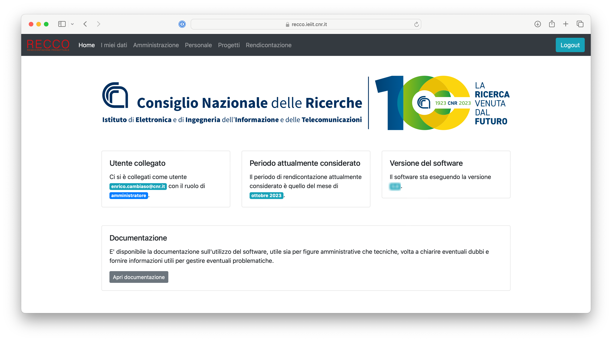
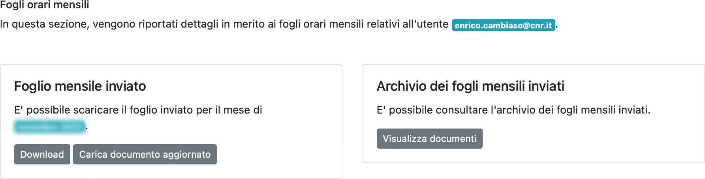
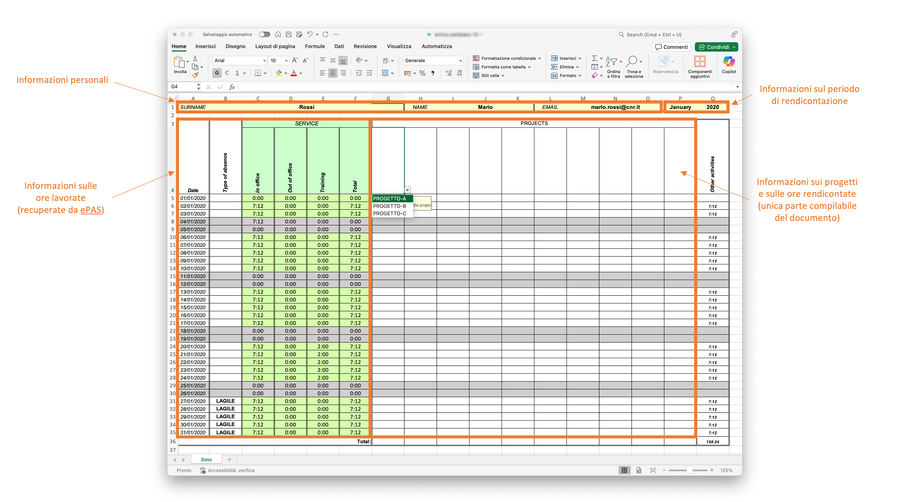

# Accesso come unità di personale coinvolta in attività di ricerca

La piattaforma RECCO fornisce alle unità di personale coinvolte in attività di ricerca la possibilità di:
i) comunicare in modo agevole informazioni sulle ore rendicontate sui propri progetti,
ii) monitorare l'allocazione delle ore personali per i diversi progetti,
iii) monitorare e pianificare la rendicontazione delle ore per i progetti per i quali si assume il ruolo di Principal Investigator.

### Accesso alla piattaforma RECCO ###

L'accesso alla piattaforma RECCO avviene attraverso il link di istituto fornito ed è concesso solo alle unità di personale abilitate.

Una volta aperta la pagina principale, viene mostrata una interfaccia analoga a quella mostrata in figura (da notare che, a titolo di esempio, in figura si fa riferimento al dominio RECCO per l'istituto [CNR-IEIIT](https://www.ieiit.cnr.it)).

L'autenticazione avviene a seguito del click sul bottone `Sign in with Microsoft`, sfruttando le credenziali Microsoft fornite dall'Ente.

### Interfaccia principale ###

Una volta autenticati, sarà disponibile una interfaccia analoga alla seguente.

L'interfaccia mostra informazioni quali:
* il logo dell'istituto di riferimento: se cliccato, verrà aperta la pagina web dell'istituto
* informazioni sull'utente collegato e sul relativo ruolo all'interno della piattaforma
* il periodo di riferimento attualmente considerato, sempre coincidente con il mese precedente a quello corrente
* la versione del software della piattaforma in esecuzione
* un link alla documentazione del software della piattaforma

Inoltre, nella parte alta della pagina, è disponibile un menu che mostra (in base al proprio ruolo) le diverse opzioni disponibili: tipicamente, per le unità di personale che non hanno compiti di gestione e mantenimento della piattaforma, sono disponibili i menu `Home`, `I miei dati`, `Progetti`.

Occorre notare che in versione mobile questo menu potrebbe assumere una forma differente, come mostrato in figura seguente.

In questo caso, per poter accedere il menu, occorre premere il bottone in alto sulla destra, che aprirà un menu in visualizzazione come elenco.

### Interfaccia "I miei dati" ###

Questa interfaccia rappresenta la schermata principale per la gestione ed il controllo delle proprie informazioni di rendicontazione.

Come mostrato in figura, l'interfaccia include in particolare tre sezioni, relative a:
* fogli orari mensili
* timesheet mensili
* ore allocate nel tempo nei vari progetti di ricerca

Vengono di seguito analizzate tutte le sezioni menzionate.

#### Fogli orari mensili ####

Questa sezione della pagina assume diverse forme, in base allo stato attuale dei propri fogli orari mensili.

In particolare, ad inizio mese, quando i fogli mensili non sono ancora stati generati per il periodo di riferimento corrente, viene mostrata una interfaccia analoga a quella mostrata nella figura seguente.

*Interfaccia dei fogli orari mensili a inizio mese, quando i fogli mensili non sono ancora stati generati*

Come è possibile notare, l'interfaccia non offre la possibilità di caricare alcun documento, né di caricarne la versione compilata, ad eccezzione dell'accesso a documenti dei fogli mensili registrati nell'archivio, antecedenti al periodo di riferimento corrente.

Dunque, a seguito della generazione dei timesheet da parte delle unità di personale dedicate a tale attività, viene mostrata una interfaccia analoga alla seguente.

*Interfaccia dei fogli orari mensili, con possibile di caricamento del documento compilato*

In questo caso è possibile scaricare il foglio orario mensile da compilare, mostrare eventuali dettagli utili a fini di redicontazione, caricare il documento compilato e, come in precedenza, accedere all'archivio storico dei documenti compilati.

Relativamente ai dettagli di rendicontazione, se abilitati dalla piattaforma, questi permettono di mostrare, per ogni progetto al quale l'unità di personale partecipa durante il periodo di riferimento corrente, informazioni sulla previsione dell'effort atteso da proposta, secondo quanto indicato dal Principal Investigator.
Un esempio di schermata viene mostrato in figura seguente.

*Schermata con le informazioni sulle ore di rendicontazione previste, in base a quanto stimato dal Principal Investigator*

In particolare, come mostrato in figura, non tutte le informazioni potrebbero essere disponibili: essendo la compilazione di tali informazioni richiesta nei confronti dei Principal Investigator dei vari progetti, in caso di mancata compilazione, le informazioni non saranno disponibili.
Per altri casi, è possibile consultare, insieme alla stima delle ore previste per il mese corrente, anche l'andamento della rendicontazione per l'intero progetto, sotto forma di valore percentuale (da notare che un valore superiore al 100% indica che si è lavorato di più sul progetto rispetto alle previsioni; analogo discorso per valori inferiori al 100%).

Nel caso in cui non sia stato caricato alcun documento entro la scadenza, viene mostrata una schermata analoga alla seguente, che non offre la possibilità di caricare il documento compilato.

*Interfaccia dei fogli orari mensili, con impossibilità di caricamento del documento compilato oltre la scadenza*

Diversamente, se il documento compilato è stato caricato correttamente, viene mostrata una schermata simile alla seguente, con la possibilità di scaricare il documento compilato.
Se tale opzione è abilitata, e se la data prevista per il caricamento dei fogli orari compilati non è passata, è possibile caricare una versione aggiornata del documento.

*Interfaccia dei fogli orari mensili, a seguito del caricamento del documento compilato, con eventuale possibilità di aggiornare il documento entro la scadenza*

#### Timesheet mensili ####

TODO

### Ore allocate nel tempo ####

TODO

### Interfaccia "Progetti" ###

TODO

### Comunicazione delle ore rendicontate ###

Partendo con la descrizione del primo punto, per poter comprendere al meglio il funzionamento del sistema, è necessario descrivere il processo di comunicazione delle ore rendicontate sui propri progetti.

#### Processo di comunicazione delle ore rendicontate ####

Il processo prevede, ogni mese, una volta al mese, il caricamento all'interno della piattaforma delle informazioni sulle ore rendicontate sui propri progetti per il mese precedente a quello corrente.
E' importante considerare che al momento la piattaforma non permette di rendicontare ore per periodi diversi dal mese precedente a quello corrente.

In particolare, dal punto di vista dell'unità di personale coinvolta in attività di ricerca, il processo è idealmente il seguente:
1. A inizio mese (tipicamente), arriverà una email sulla propria casella di posta elettronica, notificando la disponibilità del proprio foglio orario all'interno della piattaforma RECCO
2. Accedendo alla piattaforma RECCO con le proprie credenziali Microsoft fornite dall'Ente, sarà possibile scaricare il documento
3. L'unità di personale compilerà il documento di conseguenza, utilizzando l'applicativo Microsoft Excel (è importante considerare che altri applicativi non sono al momento supportati)
4. Accedendo alla piattaforma RECCO con le proprie credenziali Microsoft fornite dall'Ente, sarà possibile caricare il documento compilato
5. La piattaforma RECCO genererà i timesheet mensili per ogni progetto per il quale si è lavorato durante il periodo di riferimento
6. Arriverà una email per ogni progetto specificato all'interno del foglio orario compilato (raggruppando i progetti, ad esempio, in caso di suddivisione degli stessi in Work Package/Obiettivi Realizzativi/Spoke), indicando l'avvenuta generazione del relativo timesheet in formato PDF
7. Accedendo alla piattaforma RECCO con le proprie credenziali Microsoft fornite dall'Ente, sarà possibile scaricare i documenti prodotti
8. L'unità di personale firmerà i documenti di conseguenza
9. Accedendo alla piattaforma RECCO con le proprie credenziali Microsoft fornite dall'Ente, sarà possibile caricare il documenti firmati

#### Fogli orari da compilare ####

Al fine di uniformare il formato dei dati raccolti, è richiesta la compilazione di un documento Microsoft Excel prodotto ad-hoc, ogni mese.
Tale documento verrà prodotto da utenti specifici all'interno della piattaforma, tipicamente ogni mese, ad inizio mese, e condiviso con l'unità di personale coinvolta in attività di ricerca, attraverso la piattaforma RECCO.

Il documento assume la forma mostrata in figura seguente.

Come è possibile notare, una prima parte in alto mostra le informazioni personali dell'unità di personale e il periodo di rendicontazione considerato.
Dunque, sulla parte a sinistra del documento vengono mostrate informazioni sulle ore lavorate, compilate a partire dai dati presenti sulla piattaforma [ePAS](https://epas.amministrazione.cnr.it).
Dunque, la parte al centro del documento, l'unica parte compilabile dall'utente, è demandata alla segnalazione delle ore lavorate per ogni singolo progetto.
In particolare, per ogni colonna, è necessario specificare, compilando da sinistra a destra (celle `F4:O4`), il singolo progetto per il quale si intende rendicontare ore, tra quelli disponibili da menu a tendina.
I progetti mostrati in tale menu a tendina sono tutti i progetti in corso per almeno un giorno del periodo di riferimento corrente che vedono la partecipazione della specifica unità di personale.

### Monitoraggio delle ore rendicontate sui diversi progetti ###

TODO

### Monitoraggio e pianificazione della rendicontazione sui progetti per i quali si assume il ruolo di Principal Investigator ###

TODO
